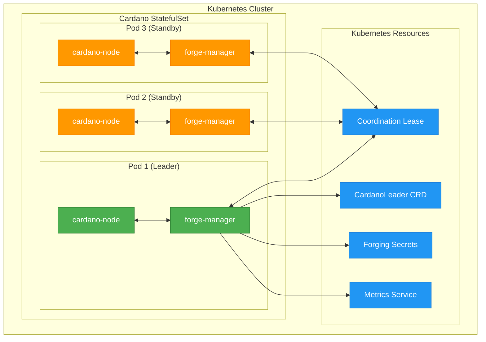

# Cardano Forge Manager

[](LICENSE)
[](https://github.com/mochipool/cardano-forge-manager/actions/workflows/build.yml)
[](https://python.org)
[](https://kubernetes.io)

> **Intelligent, cluster-aware block production management for Cardano Stake Pool Operators**

The Cardano Forge Manager provides advanced cluster-wide coordination for Cardano node deployments in Kubernetes environments. It supports both traditional single-tenant deployments and modern multi-tenant architectures, enabling efficient resource utilization while maintaining strict isolation between different networks, pools, and applications.

## 🚀 Features

### Core Capabilities
- **Cluster-Aware Leadership**: Hierarchical leadership election with local StatefulSet coordination and cluster-wide decision making
- **Dynamic Forge Management**: Real-time enable/disable of block production without pod restarts
- **Health-Based Decisions**: Integrated health checking with configurable endpoints and failure thresholds
- **Multi-Tenant Support**: Run multiple independent pools across different Cardano networks in a single cluster

### Multi-Tenant Features ✨
- **Pool Isolation**: Complete isolation between different stake pools
- **Network Support**: Simultaneous operation across mainnet, preprod, preview, and custom networks
- **Application Types**: Support for block-producer, relay, and monitoring applications
- **Resource Naming**: Intelligent resource naming with tenant-aware cluster and lease names
- **Multi-Dimensional Metrics**: Enhanced observability with network, pool, and application labels
- **Backward Compatibility**: Seamless upgrade path from single-tenant deployments

## 📋 Quick Start

### Prerequisites
- Kubernetes cluster (1.19+)
- Python 3.8+
- Cardano node deployment (as StatefulSet)
- kubectl access to the cluster

### Basic Installation

1. **Clone the repository**:
```bash
git clone https://github.com/your-repo/cardano-forge-manager.git
cd cardano-forge-manager/cluster-aware-forging
```

2. **Install dependencies**:
```bash
make install
```

3. **Run tests**:
```bash
make test
```

4. **Deploy to Kubernetes**:
```bash
# Single-tenant deployment (legacy mode)
kubectl apply -f examples/single-tenant/

# Multi-tenant deployment
kubectl apply -f examples/multi-tenant/
```

### Single-Tenant Deployment (Legacy Mode)

For existing single-tenant deployments, minimal configuration is required:

```yaml
apiVersion: apps/v1
kind: StatefulSet
metadata:
  name: cardano-node
spec:
  template:
    spec:
      containers:
      - name: forge-manager
        image: cardano-forge-manager:latest
        env:
        - name: ENABLE_CLUSTER_MANAGEMENT
          value: "true"
        - name: CLUSTER_IDENTIFIER
          value: "mainnet-pool-us-east-1"
        - name: CLUSTER_REGION
          value: "us-east-1"
        - name: HEALTH_CHECK_ENDPOINT
          value: "http://localhost:12798/health"
```

### Multi-Tenant Deployment

For new multi-tenant deployments, specify the pool and network information:

```yaml
apiVersion: apps/v1
kind: StatefulSet
metadata:
  name: cardano-node-pool1
spec:
  template:
    spec:
      containers:
      - name: forge-manager
        image: cardano-forge-manager:latest
        env:
        - name: ENABLE_CLUSTER_MANAGEMENT
          value: "true"
        # Multi-tenant configuration
        - name: POOL_ID
          value: "pool1abcdefghijklmnopqrstuvwxyz1234567890abcdefghij"
        - name: CARDANO_NETWORK
          value: "mainnet"
        - name: NETWORK_MAGIC
          value: "764824073"
        - name: POOL_TICKER
          value: "MYPOOL"
        - name: APPLICATION_TYPE
          value: "block-producer"
        # Regional configuration
        - name: CLUSTER_REGION
          value: "us-east-1"
        - name: HEALTH_CHECK_ENDPOINT
          value: "http://localhost:12798/health"
```

## 🔧 Configuration

### Environment Variables

#### Multi-Tenant Variables
| Variable | Required | Default | Description |
|----------|----------|---------|-------------|
| `POOL_ID` | Multi-tenant | - | Unique pool identifier (any string) |
| `CARDANO_NETWORK` | Multi-tenant | `mainnet` | Network name (mainnet, preprod, preview, custom) |
| `NETWORK_MAGIC` | Multi-tenant | `764824073` | Network magic number |
| `POOL_ID_HEX` | Optional | - | Hex representation of pool ID |
| `POOL_NAME` | Optional | - | Human-readable pool name |
| `POOL_TICKER` | Optional | - | Pool ticker symbol |
| `APPLICATION_TYPE` | Optional | `block-producer` | Application type |

#### Core Variables
| Variable | Required | Default | Description |
|----------|----------|---------|-------------|
| `ENABLE_CLUSTER_MANAGEMENT` | Yes | `false` | Enable cluster management |
| `CLUSTER_REGION` | Yes | `unknown` | Geographic region |
| `HEALTH_CHECK_ENDPOINT` | Optional | - | Health check HTTP endpoint |
| `HEALTH_CHECK_INTERVAL` | Optional | `30` | Health check interval (seconds) |

#### Legacy Variables (Single-Tenant)
| Variable | Required | Default | Description |
|----------|----------|---------|-------------|
| `CLUSTER_IDENTIFIER` | Legacy | hostname | Legacy cluster identifier |
| `CLUSTER_ENVIRONMENT` | Legacy | `production` | Environment name |
| `CLUSTER_PRIORITY` | Legacy | `100` | Leadership priority |

### Configuration Examples

#### Multi-Pool Mainnet Deployment
```bash
# Pool 1 - Block Producer
ENABLE_CLUSTER_MANAGEMENT=true
POOL_ID=POOL1
CARDANO_NETWORK=mainnet
NETWORK_MAGIC=764824073
POOL_TICKER=POOL1
APPLICATION_TYPE=block-producer
CLUSTER_REGION=us-east-1

# Pool 2 - Block Producer  
ENABLE_CLUSTER_MANAGEMENT=true
POOL_ID=POOL2
CARDANO_NETWORK=mainnet
NETWORK_MAGIC=764824073
POOL_TICKER=POOL2
APPLICATION_TYPE=block-producer
CLUSTER_REGION=us-east-1
```

#### Multi-Network Deployment
```bash
# Mainnet Pool
POOL_ID=MYPOOL
CARDANO_NETWORK=mainnet
NETWORK_MAGIC=764824073

# Preprod Pool (same pool ID, different network)
POOL_ID=MYPOOL
CARDANO_NETWORK=preprod
NETWORK_MAGIC=1
```

#### Custom Network
```bash
POOL_ID=TESTPOOL
CARDANO_NETWORK=custom-testnet
NETWORK_MAGIC=12345
APPLICATION_TYPE=relay
```

## 📊 Monitoring and Observability

### Metrics

The Forge Manager exports Prometheus-compatible metrics with multi-tenant labels:

#### Core Metrics
- `cardano_forge_cluster_enabled`: Cluster management status
- `cardano_forge_leadership_active`: Current leadership status
- `cardano_forge_health_status`: Health check results
- `cardano_forge_priority`: Current effective priority

#### Multi-Tenant Labels
All metrics include the following labels when in multi-tenant mode:
- `cardano_network`: Network name (mainnet, preprod, etc.)
- `pool_id`: Pool identifier
- `pool_ticker`: Pool ticker symbol
- `application_type`: Application type
- `cluster_region`: Geographic region

#### Example Queries
```promql
# Leadership status by pool
cardano_forge_leadership_active{pool_id="MYPOOL"}

# Health status by network
cardano_forge_health_status{cardano_network="mainnet"}

# All mainnet pools
cardano_forge_cluster_enabled{cardano_network="mainnet"}
```

### Health Checks

Configure health check integration:

```bash
# Basic health check
HEALTH_CHECK_ENDPOINT=http://localhost:12798/health

# Custom interval
HEALTH_CHECK_INTERVAL=60

# Health check affects leadership eligibility
# Failed health checks (3+ consecutive) prevent leadership
```

### Logging

Structured logging with multi-tenant context:

```json
{
  "timestamp": "2024-01-02T10:30:00Z",
  "level": "INFO",
  "message": "Cluster manager initialized",
  "cluster_id": "mainnet-MYPOOL-us-east-1", 
  "network": "mainnet",
  "pool_id": "MYPOOL",
  "region": "us-east-1"
}
```

## 🏗️ Architecture

### Multi-Tenant Architecture

```
┌─────────────────────────────────────────────────────────────────┐
│ Kubernetes Cluster                                              │
│ ┌─────────────────┐  ┌─────────────────┐  ┌─────────────────┐  │
│ │ Pool 1 Mainnet  │  │ Pool 1 Preprod  │  │ Pool 2 Mainnet  │  │
│ │ StatefulSet     │  │ StatefulSet     │  │ StatefulSet     │  │
│ │ ┌─────────────┐ │  │ ┌─────────────┐ │  │ ┌─────────────┐ │  │
│ │ │ Local       │ │  │ │ Local       │ │  │ │ Local       │ │  │
│ │ │ Leadership  │ │  │ │ Leadership  │ │  │ │ Leadership  │ │  │
│ │ └─────────────┘ │  │ └─────────────┘ │  │ └─────────────┘ │  │
│ └─────────────────┘  └─────────────────┘  └─────────────────┘  │
│           │                    │                    │          │
│           ▼                    ▼                    ▼          │
│ ┌─────────────────────────────────────────────────────────────┐ │
│ │ CardanoForgeCluster CRDs (Per Pool/Network)                │ │
│ │ - mainnet-POOL1-us-east-1                                  │ │
│ │ - preprod-POOL1-us-east-1                                  │ │
│ │ - mainnet-POOL2-us-east-1                                  │ │
│ └─────────────────────────────────────────────────────────────┘ │
└─────────────────────────────────────────────────────────────────┘
```

### Resource Naming Convention

- **Cluster Names**: `{network}-{pool_short}-{region}`
  - Example: `mainnet-MYPOOL-us-east-1`
- **Lease Names**: `cardano-leader-{network}-{pool_short}`
  - Example: `cardano-leader-mainnet-MYPOOL`
- **CRD Names**: Same as cluster names for uniqueness

### Leadership Election Flow

1. **Local Leadership**: StatefulSet pods elect local leader
2. **Cluster Coordination**: Local leaders coordinate via CRD
3. **Health Integration**: Health failures affect leadership eligibility
4. **Multi-Tenant Isolation**: Each pool/network combination is independent

## 🔄 Migration Guide

### From Single-Tenant to Multi-Tenant

1. **Identify Current Configuration**:
```bash
# Current single-tenant setup
CLUSTER_IDENTIFIER=mainnet-pool-us-east-1
ENABLE_CLUSTER_MANAGEMENT=true
```

2. **Add Multi-Tenant Configuration**:
```bash
# Add pool identification
POOL_ID=MYPOOL
CARDANO_NETWORK=mainnet
NETWORK_MAGIC=764824073
POOL_TICKER=MYPOOL

# Keep existing configuration
CLUSTER_REGION=us-east-1
ENABLE_CLUSTER_MANAGEMENT=true
```

3. **Deploy Updated Configuration**:
```bash
kubectl apply -f updated-deployment.yaml
```

4. **Verify Migration**:
```bash
# Check new cluster name format
kubectl get cardanoforgeclusters

# Verify metrics labels
curl http://pod-ip:8080/metrics | grep cardano_network
```

## 🧪 Development

### Setup Development Environment

```bash
# Create virtual environment
make venv

# Install dependencies
make install

# Run tests
make test

# Run with coverage
make test-coverage

# Lint code
make lint
```

### Running Tests

```bash
# All tests
make test

# Unit tests only
make test-unit

# Multi-tenant tests
make test-multi-tenant

# Integration tests (requires K8s cluster)
make test-integration

# Specific test
python -m pytest tests/test_cluster_management.py::TestMultiTenantSupport::test_pool_isolation -v
```

### Project Structure

```
cluster-aware-forging/
├── src/                          # Source code
│   ├── forgemanager.py          # Main forge manager
│   └── cluster_manager.py       # Cluster coordination
├── tests/                        # Test suite
│   ├── test_forgemanager.py     # Forge manager tests
│   └── test_cluster_management.py # Cluster management tests
├── examples/                     # Deployment examples
│   ├── single-tenant/           # Legacy examples
│   └── multi-tenant/            # Multi-tenant examples
├── docs/                        # Documentation
│   ├── FUNCTIONAL_REQUIREMENTS.md
│   ├── STATEFULSET_COORDINATION.md
│   └── *.md                     # Other documentation
├── Makefile                     # Development automation
├── requirements.txt             # Python dependencies
└── README.md                    # This file
```

## 🤝 Contributing

1. Fork the repository
2. Create a feature branch (`git checkout -b feature/amazing-feature`)
3. Make your changes
4. Add tests for new functionality
5. Run the test suite (`make test`)
6. Commit your changes (`git commit -m 'Add amazing feature'`)
7. Push to the branch (`git push origin feature/amazing-feature`)
8. Open a Pull Request

### Code Standards

- Python 3.8+ compatibility
- PEP 8 style guidelines
- Minimum 80% test coverage
- Comprehensive documentation for new features
- Multi-tenant compatibility for all new features

## 📚 Documentation

### Architecture Documentation
- [Functional Requirements](docs/FUNCTIONAL_REQUIREMENTS.md) - Detailed requirements and acceptance criteria
- [StatefulSet Coordination](docs/STATEFULSET_COORDINATION.md) - Architecture deep dive
- [System Overview](docs/SYSTEM_OVERVIEW.md) - High-level system design

### Implementation Documentation  
- [Multi-Tenant Implementation](docs/MULTI_TENANT_IMPLEMENTATION.md) - Multi-tenant design details
- [Multi-Tenant Tests](docs/MULTI_TENANT_TESTS_SUMMARY.md) - Test implementation summary
- [Health Check Integration](docs/HEALTH_CHECK_ENDPOINT.md) - Health check details

### Operational Documentation
- [Operations Guide](docs/OPERATIONS.md) - Deployment and operations
- [Testing Guide](docs/TESTING.md) - Testing procedures
- [Test Results](docs/TEST_RESULTS_SUMMARY.md) - Latest test results

## 🔒 Security

### Security Considerations

- **Tenant Isolation**: Complete isolation between different pools and networks
- **RBAC Integration**: Kubernetes role-based access control support
- **Secret Management**: Support for Kubernetes secrets for sensitive data
- **Network Policies**: Recommended network policies for enhanced isolation

### Reporting Security Issues

Please report security vulnerabilities to [security@yourcompany.com](mailto:security@yourcompany.com). Do not open public GitHub issues for security problems.

## 📄 License

This project is licensed under the Apache License 2.0 - see the [LICENSE](LICENSE) file for details.

## 🙏 Acknowledgments

- Cardano Community for requirements and feedback
- Kubernetes SIG-Apps for StatefulSet best practices
- IOG (Input Output Global) for Cardano node specifications

## 📞 Support

- **Documentation**: [docs/](docs/)
- **Issues**: [GitHub Issues](https://github.com/your-repo/cardano-forge-manager/issues)
- **Discussions**: [GitHub Discussions](https://github.com/your-repo/cardano-forge-manager/discussions)
- **Chat**: [Discord/Slack Channel](#)

---

**Built with ❤️ for the Cardano ecosystem**

# 🚀 Cardano Forge Manager

<div align="center">

[](LICENSE)
[](https://github.com/mochipool/cardano-forge-manager/actions/workflows/build.yml)
[](https://python.org)
[](https://kubernetes.io)

**High-Availability Cardano Block Producer with Dynamic Forging in Kubernetes**

*Ensures only one active forging node at a time while maintaining hot standby replicas ready for instant failover*

</div>

---

## 🎯 Overview

Cardano Forge Manager is a Kubernetes sidecar container that implements **leader election** and **dynamic credential management** for Cardano block producer nodes. It solves the challenge of running highly-available Cardano stake pools in Kubernetes by ensuring **exactly one node forges blocks** while maintaining synchronized hot standby replicas.

### ✨ Key Features

- 🏆 **Leader Election** - Kubernetes-native coordination using Lease resources
- 🔄 **Dynamic Forging** - Automatic credential distribution and SIGHUP signaling  
- 🚀 **Zero Downtime** - Hot standby replicas ready for instant failover
- 🛡️ **Secure** - Restrictive RBAC, encrypted secrets, minimal privileges
- 📊 **Observable** - Full Prometheus metrics and structured logging
- 🔧 **Production Ready** - Comprehensive error handling and edge case management
- 🎯 **Bootstrap Safe** - Prevents restart loops with intelligent startup logic

## 🏗️ Architecture



### 🔄 Operational Flow

1. **Startup Phase** 📦
   - Sidecar provisions credentials for node bootstrap (prevents restart loops)
   - Node starts with `--start-as-non-producing-node`
   - Socket monitoring waits for node readiness

2. **Leader Election** 🏆
   - Kubernetes Lease-based coordination
   - Automatic failover on leader failure
   - Conflict resolution and split-brain prevention

3. **Credential Management** 🔐
   - Leader: Injects forging keys, sends SIGHUP to enable forging
   - Non-leaders: Removes keys, sends SIGHUP to disable forging
   - Secure file permissions and immediate cleanup

4. **Monitoring** 📊
   - Prometheus metrics for alerting
   - CardanoLeader CRD status updates
   - Comprehensive logging for troubleshooting

## 🚀 Quick Start

### Prerequisites

- Kubernetes cluster (1.25+)
- Cardano forging secrets (KES, VRF, operational certificate)
- RBAC permissions for coordination and custom resources

### 1. Deploy Test Environment

```bash
# Deploy complete test setup
kubectl apply -f dummy.yaml

# Check deployment status
kubectl get pods -n cardano-test
kubectl get cardanoleader -n cardano-test
```

### 2. Monitor Leadership

```bash
# Watch leadership transitions
kubectl logs -f -l app=cardano-forge-manager -n cardano-test

# Check current leader
kubectl get cardanoleader cardano-leader -n cardano-test -o yaml

# View metrics
kubectl port-forward svc/forge-metrics 8000:8000 -n cardano-test
curl localhost:8000/metrics
```

## 📦 Container Usage

### Environment Variables

| Variable | Description | Default |
|----------|-------------|---------|
| `NAMESPACE` | Kubernetes namespace | `default` |
| `POD_NAME` | Pod identifier (auto-injected) | `""` |
| `NODE_SOCKET` | Cardano node socket path | `/ipc/node.socket` |
| `SOURCE_KES_KEY` | Source KES key path | `/secrets/kes.skey` |
| `TARGET_KES_KEY` | Target KES key path | `/ipc/kes.skey` |
| `SOURCE_VRF_KEY` | Source VRF key path | `/secrets/vrf.skey` |
| `TARGET_VRF_KEY` | Target VRF key path | `/ipc/vrf.skey` |
| `SOURCE_OP_CERT` | Source operational cert | `/secrets/node.cert` |
| `TARGET_OP_CERT` | Target operational cert | `/ipc/node.cert` |
| `LEASE_NAME` | Coordination lease name | `cardano-node-leader` |
| `LEASE_DURATION` | Lease duration (seconds) | `15` |
| `SLEEP_INTERVAL` | Main loop interval | `5` |
| `METRICS_PORT` | Prometheus metrics port | `8000` |
| `START_AS_NON_PRODUCING` | Enable startup credential provisioning | `true` |

### Example StatefulSet

```yaml
apiVersion: apps/v1
kind: StatefulSet
metadata:
  name: cardano-producer
spec:
  replicas: 3
  selector:
    matchLabels:
      app: cardano-producer
  template:
    metadata:
      labels:
        app: cardano-producer
    spec:
      shareProcessNamespace: true  # Required for SIGHUP signaling
      serviceAccountName: cardano-forge-sa
      containers:
        - name: cardano-node
          image: cardano/cardano-node:latest
          args: ["--start-as-non-producing-node"]
          # ... cardano-node configuration
          
        - name: forge-manager
          image: cardano/forge-manager:latest
          env:
            - name: NAMESPACE
              valueFrom:
                fieldRef:
                  fieldPath: metadata.namespace
            - name: POD_NAME
              valueFrom:
                fieldRef:
                  fieldPath: metadata.name
          volumeMounts:
            - name: secrets
              mountPath: /secrets
              readOnly: true
            - name: shared-data
              mountPath: /ipc
      volumes:
        - name: secrets
          secret:
            secretName: cardano-forging-keys
        - name: shared-data
          emptyDir: {}
```

## 📊 Metrics & Monitoring

### Prometheus Metrics

| Metric | Type | Description |
|--------|------|-------------|
| `cardano_forging_enabled{pod}` | Gauge | Whether pod is actively forging (0 or 1) |
| `cardano_leader_status{pod}` | Gauge | Whether pod is elected leader (0 or 1) |
| `cardano_leadership_changes_total` | Counter | Total leadership transitions |
| `cardano_sighup_signals_total{reason}` | Counter | SIGHUP signals sent to cardano-node |
| `cardano_credential_operations_total{operation,file}` | Counter | Credential file operations |

### Alerting Rules

```yaml
groups:
  - name: cardano-forge-manager
    rules:
      - alert: MultipleForgers
        expr: sum(cardano_forging_enabled) > 1
        for: 30s
        labels:
          severity: critical
        annotations:
          summary: "Multiple Cardano nodes are forging simultaneously"
          
      - alert: NoForger
        expr: sum(cardano_forging_enabled) == 0
        for: 60s
        labels:
          severity: warning
        annotations:
          summary: "No Cardano nodes are currently forging"
```

## 🔧 Development

### Building

```bash
# Build for current architecture
make build

# Build for specific platform
make build PLATFORM=linux/arm64

# Build and push
make push TAG=my-registry/forge-manager:v1.0.0

# Build with Docker
make build IMAGE_TOOL=docker
```

### Testing

```bash
# Syntax check
python -m py_compile src/forgemanager.py

# Install dependencies
pip install -r requirements.txt

# Run locally (requires K8s context)
python src/forgemanager.py

# Deploy test environment
kubectl apply -f dummy.yaml
```

### Local Development

```bash
# Set up development environment
python -m venv venv
source venv/bin/activate
pip install -r requirements.txt

# Run with local kubeconfig
export POD_NAME=test-pod
export NAMESPACE=default
export DISABLE_SOCKET_CHECK=true
python src/forgemanager.py
```

## 🛡️ Security Considerations

- **RBAC**: Minimal permissions (lease + CRD management only)
- **Secrets**: Read-only mounts, restrictive file permissions (600)
- **Privileges**: Runs as non-root (UID 10001), drops all capabilities
- **Network**: No external network access required
- **Audit**: All secret operations are logged (without content)

## 📋 Requirements

- **Kubernetes**: 1.25+ with coordination.k8s.io/v1 API
- **Python**: 3.13+ with kubernetes, psutil, prometheus-client
- **Container Runtime**: Docker or Podman with multi-arch support
- **RBAC**: ServiceAccount with lease and CRD permissions
- **Storage**: Fast storage class for CardanoLeader CRD and chain data

## 🤝 Contributing

1. Fork the repository
2. Create a feature branch (`git checkout -b feature/amazing-feature`)
3. Commit your changes (`git commit -am 'Add amazing feature'`)
4. Push to the branch (`git push origin feature/amazing-feature`)
5. Open a Pull Request

### Code Style

- Follow PEP 8 for Python code
- Use type hints where possible
- Add comprehensive docstrings
- Include unit tests for new features

## 📄 License

This project is licensed under the MIT License - see the [LICENSE](LICENSE) file for details.

## 🙏 Acknowledgments

- [Cardano](https://cardano.org) - The blockchain platform
- [Input Output](https://iohk.io) - Cardano development team
- [Kubernetes](https://kubernetes.io) - Container orchestration platform
- [Python Kubernetes Client](https://github.com/kubernetes-client/python) - API library

---

<div align="center">

**⭐ Star this repo if it helped you run a highly-available Cardano stake pool! ⭐**

Made with ❤️ by the Cardano community

</div>
