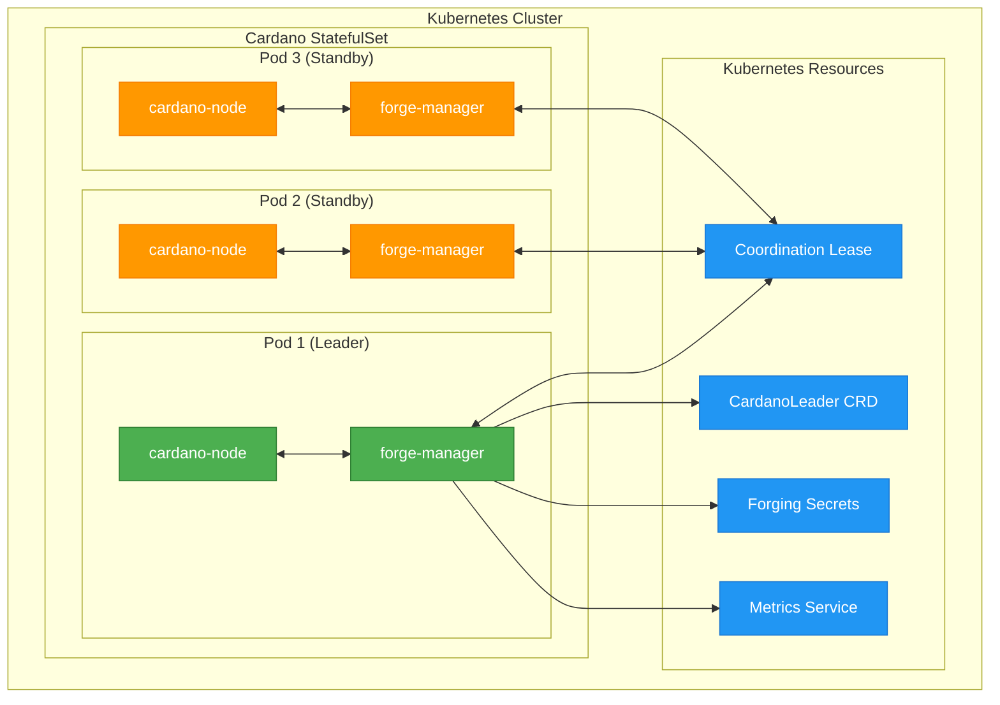

# 🚀 Cardano Forge Manager

<div align="center">

[](LICENSE)
[](https://hub.docker.com/r/cardano/forge-manager)
[](https://github.com/cardano/forge-manager/actions)
[](https://python.org)
[](https://kubernetes.io)

**High-Availability Cardano Block Producer with Dynamic Forging in Kubernetes**

*Ensures only one active forging node at a time while maintaining hot standby replicas ready for instant failover*

</div>

---

## 🎯 Overview

Cardano Forge Manager is a Kubernetes sidecar container that implements **leader election** and **dynamic credential management** for Cardano block producer nodes. It solves the challenge of running highly-available Cardano stake pools in Kubernetes by ensuring **exactly one node forges blocks** while maintaining synchronized hot standby replicas.

### ✨ Key Features

- 🏆 **Leader Election** - Kubernetes-native coordination using Lease resources
- 🔄 **Dynamic Forging** - Automatic credential distribution and SIGHUP signaling  
- 🚀 **Zero Downtime** - Hot standby replicas ready for instant failover
- 🛡️ **Secure** - Restrictive RBAC, encrypted secrets, minimal privileges
- 📊 **Observable** - Full Prometheus metrics and structured logging
- 🔧 **Production Ready** - Comprehensive error handling and edge case management
- 🎯 **Bootstrap Safe** - Prevents restart loops with intelligent startup logic

## 🏗️ Architecture



### 🔄 Operational Flow

1. **Startup Phase** 📦
   - Sidecar provisions credentials for node bootstrap (prevents restart loops)
   - Node starts with `--start-as-non-producing-node`
   - Socket monitoring waits for node readiness

2. **Leader Election** 🏆
   - Kubernetes Lease-based coordination
   - Automatic failover on leader failure
   - Conflict resolution and split-brain prevention

3. **Credential Management** 🔐
   - Leader: Injects forging keys, sends SIGHUP to enable forging
   - Non-leaders: Removes keys, sends SIGHUP to disable forging
   - Secure file permissions and immediate cleanup

4. **Monitoring** 📊
   - Prometheus metrics for alerting
   - CardanoLeader CRD status updates
   - Comprehensive logging for troubleshooting

## 🚀 Quick Start

### Prerequisites

- Kubernetes cluster (1.25+)
- Cardano forging secrets (KES, VRF, operational certificate)
- RBAC permissions for coordination and custom resources

### 1. Deploy Test Environment

```bash
# Deploy complete test setup
kubectl apply -f dummy.yaml

# Check deployment status
kubectl get pods -n cardano-test
kubectl get cardanoleader -n cardano-test
```

### 2. Monitor Leadership

```bash
# Watch leadership transitions
kubectl logs -f -l app=cardano-forge-manager -n cardano-test

# Check current leader
kubectl get cardanoleader cardano-leader -n cardano-test -o yaml

# View metrics
kubectl port-forward svc/forge-metrics 8000:8000 -n cardano-test
curl localhost:8000/metrics
```

## 📦 Container Usage

### Environment Variables

| Variable | Description | Default |
|----------|-------------|---------|
| `NAMESPACE` | Kubernetes namespace | `default` |
| `POD_NAME` | Pod identifier (auto-injected) | `""` |
| `NODE_SOCKET` | Cardano node socket path | `/ipc/node.socket` |
| `SOURCE_KES_KEY` | Source KES key path | `/secrets/kes.skey` |
| `TARGET_KES_KEY` | Target KES key path | `/ipc/kes.skey` |
| `SOURCE_VRF_KEY` | Source VRF key path | `/secrets/vrf.skey` |
| `TARGET_VRF_KEY` | Target VRF key path | `/ipc/vrf.skey` |
| `SOURCE_OP_CERT` | Source operational cert | `/secrets/node.cert` |
| `TARGET_OP_CERT` | Target operational cert | `/ipc/node.cert` |
| `LEASE_NAME` | Coordination lease name | `cardano-node-leader` |
| `LEASE_DURATION` | Lease duration (seconds) | `15` |
| `SLEEP_INTERVAL` | Main loop interval | `5` |
| `METRICS_PORT` | Prometheus metrics port | `8000` |
| `START_AS_NON_PRODUCING` | Enable startup credential provisioning | `true` |

### Example StatefulSet

```yaml
apiVersion: apps/v1
kind: StatefulSet
metadata:
  name: cardano-producer
spec:
  replicas: 3
  selector:
    matchLabels:
      app: cardano-producer
  template:
    metadata:
      labels:
        app: cardano-producer
    spec:
      shareProcessNamespace: true  # Required for SIGHUP signaling
      serviceAccountName: cardano-forge-sa
      containers:
        - name: cardano-node
          image: cardano/cardano-node:latest
          args: ["--start-as-non-producing-node"]
          # ... cardano-node configuration
          
        - name: forge-manager
          image: cardano/forge-manager:latest
          env:
            - name: NAMESPACE
              valueFrom:
                fieldRef:
                  fieldPath: metadata.namespace
            - name: POD_NAME
              valueFrom:
                fieldRef:
                  fieldPath: metadata.name
          volumeMounts:
            - name: secrets
              mountPath: /secrets
              readOnly: true
            - name: shared-data
              mountPath: /ipc
      volumes:
        - name: secrets
          secret:
            secretName: cardano-forging-keys
        - name: shared-data
          emptyDir: {}
```

## 📊 Metrics & Monitoring

### Prometheus Metrics

| Metric | Type | Description |
|--------|------|-------------|
| `cardano_forging_enabled{pod}` | Gauge | Whether pod is actively forging (0 or 1) |
| `cardano_leader_status{pod}` | Gauge | Whether pod is elected leader (0 or 1) |
| `cardano_leadership_changes_total` | Counter | Total leadership transitions |
| `cardano_sighup_signals_total{reason}` | Counter | SIGHUP signals sent to cardano-node |
| `cardano_credential_operations_total{operation,file}` | Counter | Credential file operations |

### Alerting Rules

```yaml
groups:
  - name: cardano-forge-manager
    rules:
      - alert: MultipleForgers
        expr: sum(cardano_forging_enabled) > 1
        for: 30s
        labels:
          severity: critical
        annotations:
          summary: "Multiple Cardano nodes are forging simultaneously"
          
      - alert: NoForger
        expr: sum(cardano_forging_enabled) == 0
        for: 60s
        labels:
          severity: warning
        annotations:
          summary: "No Cardano nodes are currently forging"
```

## 🔧 Development

### Building

```bash
# Build for current architecture
make build

# Build for specific platform
make build PLATFORM=linux/arm64

# Build and push
make push TAG=my-registry/forge-manager:v1.0.0

# Build with Docker
make build IMAGE_TOOL=docker
```

### Testing

```bash
# Syntax check
python -m py_compile src/forgemanager.py

# Install dependencies
pip install -r requirements.txt

# Run locally (requires K8s context)
python src/forgemanager.py

# Deploy test environment
kubectl apply -f dummy.yaml
```

### Local Development

```bash
# Set up development environment
python -m venv venv
source venv/bin/activate
pip install -r requirements.txt

# Run with local kubeconfig
export POD_NAME=test-pod
export NAMESPACE=default
export DISABLE_SOCKET_CHECK=true
python src/forgemanager.py
```

## 🛡️ Security Considerations

- **RBAC**: Minimal permissions (lease + CRD management only)
- **Secrets**: Read-only mounts, restrictive file permissions (600)
- **Privileges**: Runs as non-root (UID 10001), drops all capabilities
- **Network**: No external network access required
- **Audit**: All secret operations are logged (without content)

## 📋 Requirements

- **Kubernetes**: 1.25+ with coordination.k8s.io/v1 API
- **Python**: 3.13+ with kubernetes, psutil, prometheus-client
- **Container Runtime**: Docker or Podman with multi-arch support
- **RBAC**: ServiceAccount with lease and CRD permissions
- **Storage**: Fast storage class for CardanoLeader CRD and chain data

## 🤝 Contributing

1. Fork the repository
2. Create a feature branch (`git checkout -b feature/amazing-feature`)
3. Commit your changes (`git commit -am 'Add amazing feature'`)
4. Push to the branch (`git push origin feature/amazing-feature`)
5. Open a Pull Request

### Code Style

- Follow PEP 8 for Python code
- Use type hints where possible
- Add comprehensive docstrings
- Include unit tests for new features

## 📄 License

This project is licensed under the MIT License - see the [LICENSE](LICENSE) file for details.

## 🙏 Acknowledgments

- [Cardano](https://cardano.org) - The blockchain platform
- [Input Output](https://iohk.io) - Cardano development team
- [Kubernetes](https://kubernetes.io) - Container orchestration platform
- [Python Kubernetes Client](https://github.com/kubernetes-client/python) - API library

---

<div align="center">

**⭐ Star this repo if it helped you run a highly-available Cardano stake pool! ⭐**

Made with ❤️ by the Cardano community

</div>