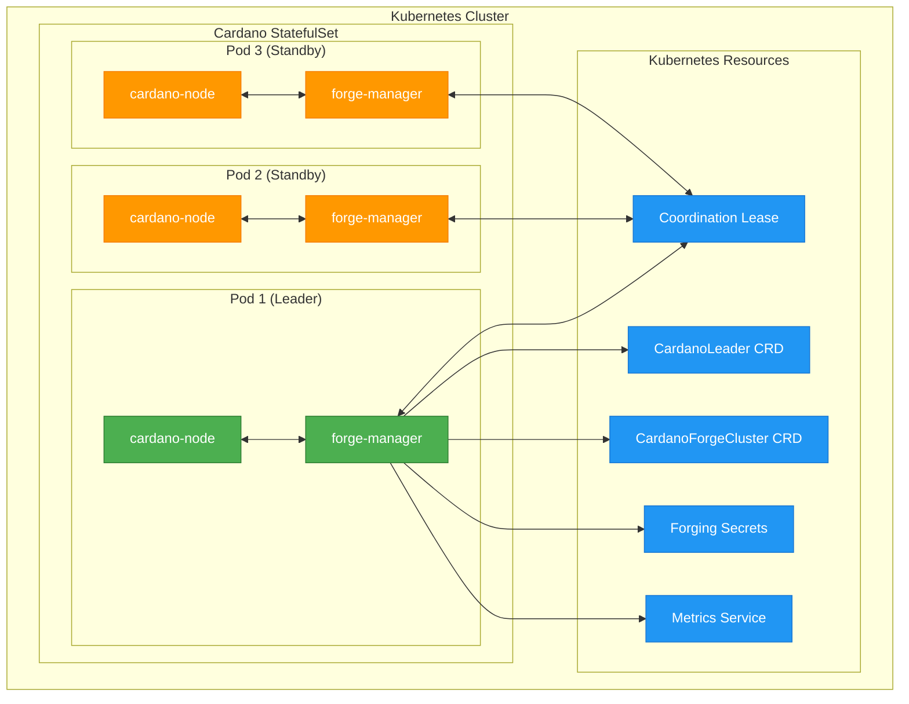
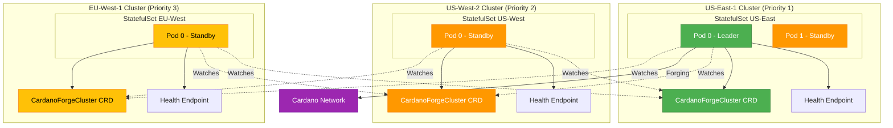

<div align="center">

# 🚀 Cardano Forge Manager

[](LICENSE)
[](https://github.com/mochipool/cardano-forge-manager/actions/workflows/build.yml)
[](https://python.org)
[](https://kubernetes.io)

**High-Availability Cardano Block Producer with Cluster-Wide Forging Coordination**

*Ensures only one active forging node across multiple regions while maintaining hot standby replicas ready for instant failover*

</div>

---

## 🎯 Overview

Cardano Forge Manager is a Kubernetes sidecar container that implements **cluster-aware leader election** and **dynamic credential management** for Cardano block producer nodes. It solves the challenge of running highly-available Cardano stake pools across multiple geographic regions by ensuring **exactly one node forges blocks globally** while maintaining synchronized hot standby replicas.

### ✨ Key Features

- 🌍 **Cluster-Wide Coordination** - Cross-region forge management with priority-based failover
- 🏆 **Leader Election** - Kubernetes-native coordination using Lease resources
- 🔄 **Dynamic Forging** - Automatic credential distribution and SIGHUP signaling  
- 🏥 **Health-Based Failover** - Automatic failover based on cluster health monitoring
- 🚀 **Zero Downtime** - Hot standby replicas ready for instant failover
- 🔀 **Multi-Tenant Support** - Run multiple pools in the same Kubernetes cluster
- 🛡️ **Secure** - Restrictive RBAC, encrypted secrets, minimal privileges
- 📊 **Observable** - Full Prometheus metrics and structured logging
- 🔧 **Production Ready** - Comprehensive error handling and edge case management
- 🎯 **Bootstrap Safe** - Prevents restart loops with intelligent startup logic

## 🏗️ Architecture

### Single Cluster Architecture



### Multi-Region Architecture



### 🔄 Operational Flow

1. **Startup Phase** 📦
   - Sidecar provisions credentials for node bootstrap (prevents restart loops)
   - Node starts with `--start-as-non-producing-node`
   - Socket monitoring waits for node readiness

2. **Cluster-Wide Coordination** 🌍
   - Each cluster creates a CardanoForgeCluster CRD with priority
   - Forge managers watch all cluster CRDs for state changes
   - Only the highest priority healthy cluster is allowed to forge

3. **Local Leader Election** 🏆
   - Within allowed clusters, Kubernetes Lease-based election
   - Automatic failover on leader failure
   - Conflict resolution and split-brain prevention

4. **Credential Management** 🔐
   - Leader: Injects forging keys, sends SIGHUP to enable forging
   - Non-leaders: Removes keys, sends SIGHUP to disable forging
   - Secure file permissions and immediate cleanup

5. **Startup Synchronization** 🔄
   - Native sidecar pattern with startup probes (K8s 1.29+)
   - Ensures cardano-node starts only after credentials are ready
   - Eliminates restart loops from missing credential files
   - HTTP endpoint for startup status monitoring

6. **Health-Based Failover** 🏥
   - Optional health check integration
   - Automatic priority adjustment on health failures
   - Cross-cluster failover when primary becomes unhealthy

7. **Monitoring** 📊
   - Prometheus metrics for alerting
   - CRD status updates (CardanoLeader + CardanoForgeCluster)
   - Comprehensive logging for troubleshooting

## 🚀 Quick Start

### Prerequisites

- Kubernetes cluster (1.25+)
- Helm 3.x for CRD installation
- Cardano forging secrets (KES, VRF, operational certificate)
- RBAC permissions for coordination and custom resources

### 1. Install CRDs

```bash
# Install Custom Resource Definitions
helm install cardano-forge-crds ./charts/cardano-forge-crds \
  --namespace cardano-system \
  --create-namespace

# Verify installation
kubectl get crd cardanoleaders.cardano.io
kubectl get crd cardanoforgeclusters.cardano.io
```

### 2. Deploy Single-Cluster Setup

```bash
# Create secrets
kubectl create secret generic cardano-forging-keys \
  --from-file=kes.skey=path/to/kes.skey \
  --from-file=vrf.skey=path/to/vrf.skey \
  --from-file=node.cert=path/to/node.cert \
  --namespace cardano-mainnet

# Deploy StatefulSet (see examples below)
kubectl apply -f cardano-producer-statefulset.yaml

# Check status
kubectl get pods -n cardano-mainnet
kubectl get cardanoleader -n cardano-mainnet
```

### 3. Monitor Operations

```bash
# Watch leadership transitions
kubectl logs -f -l app=cardano-producer -c forge-manager -n cardano-mainnet

# Check current leader
kubectl get cardanoleader cardano-leader -n cardano-mainnet -o yaml

# View cluster coordination (multi-cluster only)
kubectl get cardanoforgeclusters -o wide

# View metrics
kubectl port-forward svc/cardano-producer 8000:8000 -n cardano-mainnet
curl localhost:8000/metrics | grep cardano_
```

## 📦 Configuration

### Environment Variables

#### Core Configuration

| Variable | Description | Default |
|----------|-------------|---------|
| `NAMESPACE` | Kubernetes namespace | `default` |
| `POD_NAME` | Pod identifier (auto-injected) | `""` |
| `NODE_SOCKET` | Cardano node socket path | `/ipc/node.socket` |
| `LEASE_NAME` | Coordination lease name | `cardano-node-leader` |
| `LEASE_DURATION` | Lease duration (seconds) | `15` |
| `SLEEP_INTERVAL` | Main loop interval (seconds) | `5` |
| `METRICS_PORT` | Prometheus metrics port | `8000` |

#### Credential Paths

| Variable | Description | Default |
|----------|-------------|---------|
| `SOURCE_KES_KEY` | Source KES key path | `/secrets/kes.skey` |
| `TARGET_KES_KEY` | Target KES key path | `/ipc/kes.skey` |
| `SOURCE_VRF_KEY` | Source VRF key path | `/secrets/vrf.skey` |
| `TARGET_VRF_KEY` | Target VRF key path | `/ipc/vrf.skey` |
| `SOURCE_OP_CERT` | Source operational cert | `/secrets/node.cert` |
| `TARGET_OP_CERT` | Target operational cert | `/ipc/node.cert` |

#### Multi-Tenant Configuration

| Variable | Description | Default | Required |
|----------|-------------|---------|----------|
| `CARDANO_NETWORK` | Network name | `mainnet` | Yes |
| `NETWORK_MAGIC` | Network magic number | `764824073` | Yes |
| `POOL_ID` | Pool ID (bech32) | `""` | For multi-tenant |
| `POOL_ID_HEX` | Pool ID (hex) | `""` | For multi-tenant |
| `POOL_NAME` | Human-readable pool name | `""` | Optional |
| `POOL_TICKER` | Pool ticker symbol | `""` | Optional |
| `APPLICATION_TYPE` | Application type | `block-producer` | Optional |

#### Cluster Management

| Variable | Description | Default |
|----------|-------------|---------|
| `ENABLE_CLUSTER_MANAGEMENT` | Enable cluster-wide coordination | `false` |
| `CLUSTER_REGION` | Geographic region identifier | `unknown` |
| `CLUSTER_ENVIRONMENT` | Environment classification | `production` |
| `CLUSTER_PRIORITY` | Base priority (1=highest, 999=lowest) | `100` |
| `HEALTH_CHECK_ENDPOINT` | HTTP endpoint for health checks | `""` |
| `HEALTH_CHECK_INTERVAL` | Health check interval (seconds) | `30` |

### Example Configurations

#### Single-Cluster Setup

```yaml
apiVersion: apps/v1
kind: StatefulSet
metadata:
  name: cardano-producer
  namespace: cardano-mainnet
spec:
  replicas: 3
  serviceName: cardano-producer
  selector:
    matchLabels:
      app: cardano-producer
  template:
    metadata:
      labels:
        app: cardano-producer
    spec:
      shareProcessNamespace: true
      serviceAccountName: cardano-forge-crds
      containers:
        - name: cardano-node
          image: inputoutput/cardano-node:8.9.0
          args:
            - "run"
            - "--config"
            - "/config/mainnet-config.json"
            - "--topology"
            - "/config/mainnet-topology.json"
            - "--database-path"
            - "/data/db"
            - "--socket-path"
            - "/ipc/node.socket"
            - "--start-as-non-producing-node"
          volumeMounts:
            - name: config
              mountPath: /config
            - name: data
              mountPath: /data
            - name: shared-data
              mountPath: /ipc
          resources:
            requests:
              cpu: "2"
              memory: "8Gi"
            limits:
              cpu: "4"
              memory: "16Gi"

        - name: forge-manager
          image: cardano/forge-manager:2.0.0
          env:
            - name: NAMESPACE
              valueFrom:
                fieldRef:
                  fieldPath: metadata.namespace
            - name: POD_NAME
              valueFrom:
                fieldRef:
                  fieldPath: metadata.name
            - name: CARDANO_NETWORK
              value: "mainnet"
            - name: NETWORK_MAGIC
              value: "764824073"
          volumeMounts:
            - name: secrets
              mountPath: /secrets
              readOnly: true
            - name: shared-data
              mountPath: /ipc
          ports:
            - containerPort: 8000
              name: metrics

      volumes:
        - name: config
          configMap:
            name: cardano-config
        - name: secrets
          secret:
            secretName: cardano-forging-keys
            defaultMode: 0600
        - name: shared-data
          emptyDir: {}
```

#### Multi-Cluster Setup

```yaml
# Primary cluster (US-East-1)
- name: forge-manager
  image: cardano/forge-manager:2.0.0
  env:
    - name: NAMESPACE
      valueFrom:
        fieldRef:
          fieldPath: metadata.namespace
    - name: POD_NAME
      valueFrom:
        fieldRef:
          fieldPath: metadata.name
    # Multi-tenant configuration
    - name: CARDANO_NETWORK
      value: "mainnet"
    - name: NETWORK_MAGIC
      value: "764824073"
    - name: POOL_ID
      value: "pool1abcd1234567890abcd1234567890abcd1234567890abcd1234"
    - name: POOL_TICKER
      value: "MYPOOL"
    # Cluster management (enable for multi-cluster)
    - name: ENABLE_CLUSTER_MANAGEMENT
      value: "true"
    - name: CLUSTER_REGION
      value: "us-east-1"
    - name: CLUSTER_PRIORITY
      value: "1"  # Highest priority
    - name: HEALTH_CHECK_ENDPOINT
      value: "https://monitoring.example.com/health/us-east-1"
```

## 📊 Metrics & Monitoring

### Prometheus Metrics

#### Local Metrics

| Metric | Type | Labels | Description |
|--------|------|--------|-------------|
| `cardano_forging_enabled` | Gauge | pod, network, pool_id, application | Whether pod is actively forging (0 or 1) |
| `cardano_leader_status` | Gauge | pod, network, pool_id, application | Whether pod is elected leader (0 or 1) |
| `cardano_leadership_changes_total` | Counter | - | Total leadership transitions |
| `cardano_sighup_signals_total` | Counter | reason | SIGHUP signals sent to cardano-node |
| `cardano_credential_operations_total` | Counter | operation, file | Credential file operations |

#### Cluster-Wide Metrics

| Metric | Type | Labels | Description |
|--------|------|--------|-------------|
| `cardano_cluster_forge_enabled` | Gauge | cluster, region, network, pool_id | Whether cluster is enabled for forging |
| `cardano_cluster_forge_priority` | Gauge | cluster, region, network, pool_id | Effective priority of cluster |
| `cardano_cluster_health_check_success` | Gauge | cluster | Health check success status |
| `cardano_cluster_health_check_consecutive_failures` | Gauge | cluster | Consecutive health check failures |

### Alerting Rules

```yaml
groups:
  - name: cardano-forge-manager
    rules:
      # Critical: Multiple nodes forging in same cluster
      - alert: MultipleLocalForgers
        expr: sum(cardano_forging_enabled) > 1
        for: 30s
        labels:
          severity: critical
        annotations:
          summary: "Multiple pods forging in same cluster"
          
      # Critical: Multiple clusters forging globally
      - alert: MultipleClusterForgers
        expr: sum(cardano_cluster_forge_enabled) > 1
        for: 30s
        labels:
          severity: critical
        annotations:
          summary: "Multiple clusters forging simultaneously"
          
      # Warning: No cluster forging
      - alert: NoActiveForger
        expr: sum(cardano_cluster_forge_enabled) == 0
        for: 60s
        labels:
          severity: warning
        annotations:
          summary: "No cluster is currently forging"
          
      # Warning: Health degraded
      - alert: ClusterHealthDegraded
        expr: cardano_cluster_health_check_consecutive_failures > 1
        for: 2m
        labels:
          severity: warning
        annotations:
          summary: "Cluster {{ $labels.cluster }} health degraded"
```

## 🛠️ Operations

### Manual Failover

```bash
# Disable primary cluster for maintenance
kubectl patch cardanoforgeCluster mainnet-pool1abc-us-east-1 --type='merge' -p='{
  "spec": {
    "forgeState": "Disabled",
    "override": {
      "enabled": true,
      "reason": "Planned maintenance",
      "expiresAt": "'$(date -d "+4 hours" --iso-8601=seconds)'"
    }
  }
}'

# Wait for secondary to take over
kubectl get cardanoforgeclusters -w

# After maintenance, re-enable
kubectl patch cardanoforgeCluster mainnet-pool1abc-us-east-1 --type='merge' -p='{
  "spec": {
    "forgeState": "Priority-based",
    "override": {
      "enabled": false
    }
  }
}'
```

### Emergency Disable

```bash
# Immediately disable a cluster
kubectl patch cardanoforgeCluster mainnet-pool1abc-us-east-1 --type='merge' -p='{
  "spec": {
    "forgeState": "Disabled"
  }
}'
```

### Monitoring Status

```bash
# Check all clusters
kubectl get cardanoforgeclusters -o custom-columns='NAME:.metadata.name,STATE:.status.effectiveState,PRIORITY:.status.effectivePriority,LEADER:.status.activeLeader,HEALTHY:.status.healthStatus.healthy'

# Watch for changes
kubectl get cardanoforgeclusters -w

# Check detailed status
kubectl describe cardanoforgeCluster mainnet-pool1abc-us-east-1
```

## 🔧 Development

### Building

```bash
# Build for current architecture
make build

# Build for specific platform
make build PLATFORM=linux/arm64

# Build and push
make push TAG=my-registry/forge-manager:v2.0.0

# Build with Docker
make build IMAGE_TOOL=docker
```

### Testing

```bash
# Run unit tests
make test

# Run with coverage
make test-coverage

# Syntax check
python -m py_compile src/forgemanager.py src/cluster_manager.py

# Install dependencies
pip install -r requirements.txt

# Run locally (requires K8s context)
python src/forgemanager.py
```

### Local Development

```bash
# Set up development environment
python -m venv venv
source venv/bin/activate
pip install -r requirements.txt

# Run with local kubeconfig
export POD_NAME=test-pod
export NAMESPACE=default
export DISABLE_SOCKET_CHECK=true
export ENABLE_CLUSTER_MANAGEMENT=false
python src/forgemanager.py
```

## 🛡️ Security Considerations

- **RBAC**: Minimal permissions (lease + CRD management only)
- **Secrets**: Read-only mounts, restrictive file permissions (600)
- **Privileges**: Runs as non-root (UID 10001), drops all capabilities
- **Network**: No external network access required (except health checks)
- **Audit**: All secret operations are logged (without content)
- **Multi-Tenant Isolation**: Separate leases and CRDs per pool/network

## 📋 Requirements

- **Kubernetes**: 1.25+ with coordination.k8s.io/v1 API
- **Python**: 3.13+ with kubernetes, psutil, prometheus-client, requests
- **Container Runtime**: Docker or Podman with multi-arch support
- **RBAC**: ServiceAccount with lease and CRD permissions
- **Storage**: Fast storage class for CRDs and chain data
- **Helm**: 3.x for CRD installation

## 📚 Documentation

- **[Architecture Documentation](docs/ARCHITECTURE.md)** - Technical architecture and implementation details
- **[Technical Requirements](docs/TECHNICAL_REQUIREMENTS.md)** - Comprehensive requirements specification and edge cases
- **[Functional Requirements](docs/FUNCTIONAL_REQUIREMENTS.md)** - Multi-tenant functional requirements
- **[Operations Guide](docs/OPERATIONS.md)** - Deployment and operational procedures
- **[Implementation Notes](docs/IMPLEMENTATION_NOTES.md)** - Technical implementation details
- **[System Design](docs/SYSTEM_DESIGN.md)** - System design, testing, and validation
- **[Helm Chart Documentation](charts/cardano-forge-crds/README.md)** - CRD installation and configuration

## 🤝 Contributing

1. Fork the repository
2. Create a feature branch (`git checkout -b feature/amazing-feature`)
3. Commit your changes (`git commit -am 'Add amazing feature'`)
4. Push to the branch (`git push origin feature/amazing-feature`)
5. Open a Pull Request

### Code Style

- Follow PEP 8 for Python code
- Use type hints where possible
- Add comprehensive docstrings
- Include unit tests for new features

## 📄 License

This project is licensed under the MIT License - see the [LICENSE](LICENSE) file for details.

## 🙏 Acknowledgments

- [Cardano](https://cardano.org) - The blockchain platform
- [Input Output](https://iohk.io) - Cardano development team
- [Kubernetes](https://kubernetes.io) - Container orchestration platform
- [Python Kubernetes Client](https://github.com/kubernetes-client/python) - API library

## 🆕 What's New in v2.0

- 🌍 **Cluster-Wide Coordination** - Manage forging across multiple geographic regions
- 🏥 **Health-Based Failover** - Automatic failover based on health monitoring
- 🔀 **Multi-Tenant Support** - Run multiple pools in the same Kubernetes cluster
- 📈 **Enhanced Metrics** - Cluster-wide metrics for better observability
- 🎯 **Priority-Based** - Configurable priority system for failover control
- 🛠️ **Manual Override** - Temporary override support for maintenance
- 📝 **Status Tracking** - Comprehensive CRD status fields for monitoring
- ⚡ **Improved Performance** - Optimized leader election and credential management

---

<div align="center">

**⭐ Star this repo if it helped you run a highly-available Cardano stake pool! ⭐**

Made with ❤️ by the Cardano community

</div>
