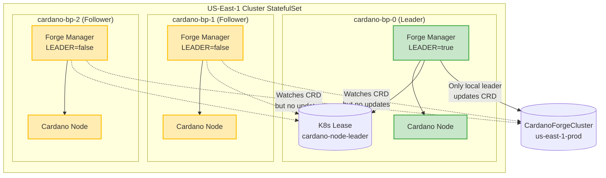
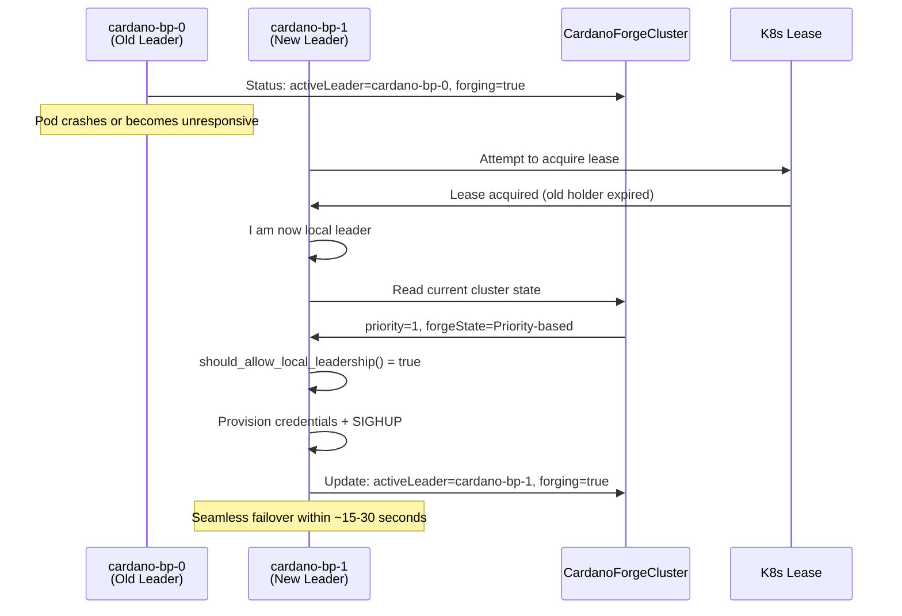

# StatefulSet Coordination in Cluster-Wide Forge Management

## The Two-Level Leadership Model

When running forge managers in StatefulSets across multiple clusters, we have a **hierarchical leadership structure**:

```
Global Level (Cluster-wide):   [US-East-1] ←→ [US-West-2] ←→ [EU-West-1]
                                   ↓               ↓               ↓  
Local Level (StatefulSet):     Pod-0,1,2       Pod-0,1,2       Pod-0,1,2
                                   ↓               ↓               ↓
Process Level:              cardano-node    cardano-node    cardano-node
```

## Detailed Architecture

### Level 1: Local StatefulSet Leader Election (Existing Behavior)

Each cluster's StatefulSet runs **traditional Kubernetes leader election**:



### Level 2: Cluster-Wide Coordination (New Feature)

Only the **local leaders** from each cluster participate in global coordination:

```mermaid
sequenceDiagram
    participant US1_L as US-East-1<br/>Local Leader<br/>(cardano-bp-0)
    participant US1_F as US-East-1<br/>Followers<br/>(cardano-bp-1,2)
    participant US2_L as US-West-2<br/>Local Leader<br/>(cardano-bp-0)
    participant EU1_L as EU-West-1<br/>Local Leader<br/>(cardano-bp-0)
    participant CRD1 as CardanoForgeCluster<br/>us-east-1-prod
    participant CRD2 as CardanoForgeCluster<br/>us-west-2-prod
    
    Note over US1_L,EU1_L: Step 1: Local Leader Election (within each StatefulSet)
    
    US1_L->>US1_L: Acquire local lease
    US1_L->>US1_L: I am local leader ✅
    US1_F->>US1_F: Failed to acquire lease
    US1_F->>US1_F: I am follower ❌
    
    US2_L->>US2_L: Acquire local lease ✅ 
    EU1_L->>EU1_L: Acquire local lease ✅
    
    Note over US1_L,EU1_L: Step 2: Cluster-Wide Coordination (only local leaders participate)
    
    US1_L->>CRD1: Update: priority=1, healthy=true
    US2_L->>CRD2: Update: priority=2, healthy=true
    EU1_L->>CRD1: Watch CRD changes
    EU1_L->>CRD2: Watch CRD changes
    
    US1_L->>US1_L: Check cluster priority: I'm highest (1)
    US1_L->>US1_L: should_allow_local_leadership() = true
    US1_L->>US1_L: Provision credentials + SIGHUP
    
    US2_L->>US2_L: Check cluster priority: US-East-1 is higher
    US2_L->>US2_L: should_allow_local_leadership() = false
    US2_L->>US2_L: Remove credentials + SIGHUP
    
    Note over US1_F: Followers never participate in cluster-wide decisions
    US1_F->>US1_F: I'm not local leader, skip cluster logic
    US1_F->>US1_F: Remove credentials (standard follower behavior)
```



## Implementation Details

### Modified Forge Manager Logic

The core logic becomes:

```python
def main_loop():
    """Main forge manager loop with hierarchical leadership."""
    
    while True:
        # Step 1: LOCAL LEADER ELECTION (Traditional StatefulSet behavior)
        local_leader = attempt_local_leader_election()
        
        if not local_leader:
            # I'm a follower in this StatefulSet
            logger.info("Not local leader - removing credentials and sleeping")
            remove_forging_credentials()
            update_local_metrics(leader=False, forging=False)
            time.sleep(SLEEP_INTERVAL)
            continue
            
        # Step 2: CLUSTER-WIDE COORDINATION (Only for local leaders)
        logger.info("I am local leader - checking cluster-wide permissions")
        
        if not cluster_manager_enabled():
            # Traditional single-cluster mode
            logger.info("Single-cluster mode - provisioning credentials")
            provision_forging_credentials()
            send_sighup_to_cardano_node("local_leadership_acquired")
            update_local_metrics(leader=True, forging=True)
        else:
            # Cluster-wide mode - check global permissions
            cluster_allows_forging, reason = cluster_manager.should_allow_local_leadership()
            
            if cluster_allows_forging:
                logger.info(f"Cluster-wide leadership granted - reason: {reason}")
                provision_forging_credentials()
                send_sighup_to_cardano_node("cluster_leadership_acquired")
                update_local_metrics(leader=True, forging=True)
                update_cluster_metrics(cluster_forging=True)
                
                # Update CRD status (only local leader can do this)
                update_cluster_crd_status(
                    active_leader=POD_NAME,
                    forging_enabled=True
                )
            else:
                logger.info(f"Cluster-wide leadership denied - reason: {reason}")
                remove_forging_credentials()
                send_sighup_to_cardano_node("cluster_leadership_denied")
                update_local_metrics(leader=True, forging=False)  # Leader but not forging
                update_cluster_metrics(cluster_forging=False)
                
                # Update CRD status
                update_cluster_crd_status(
                    active_leader="",
                    forging_enabled=False
                )
        
        time.sleep(SLEEP_INTERVAL)
```

### Key Coordination Principles

#### 1. **Single Point of Truth per Cluster**
- Only the **local StatefulSet leader** manages the `CardanoForgeCluster` CRD
- Followers watch CRDs but never modify them
- Prevents conflicting updates and race conditions

#### 2. **Health Check Responsibility**
- Only the local leader performs health checks
- Health status affects the entire cluster's priority
- Followers inherit the cluster-wide health decisions

#### 3. **Credential Management**
- Local leader: Manages credentials based on cluster-wide decisions
- Followers: Always remove credentials (standard StatefulSet behavior)
- No risk of multiple pods in the same cluster forging simultaneously

## Failure Scenarios

### Scenario 1: Local Leader Pod Fails



### Scenario 2: Split-Brain Prevention

The two-level architecture prevents split-brain scenarios:

```mermaid
graph TB
    subgraph "Failure Scenario: Network Partition"
        subgraph "US-East-1: Isolated"
            US1_L[cardano-bp-0<br/>Local Leader]
            US1_L --> US1_LEASE[(Local Lease)]
            US1_L --> US1_CRD[(CRD - Isolated)]
        end
        
        subgraph "US-West-2: Can see global state"
            US2_L[cardano-bp-0<br/>Local Leader]
            US2_L --> US2_LEASE[(Local Lease)]
            US2_L --> GLOBAL_CRD[(CRD - Global View)]
        end
    end
    
    US1_L -.->|❌ Cannot update<br/>global CRDs| GLOBAL_CRD
    US2_L -->|✅ Can update<br/>global CRDs| GLOBAL_CRD
    
    Note1[US-East-1: Loses cluster leadership<br/>due to CRD update failures]
    Note2[US-West-2: Takes over cluster leadership<br/>safely]
    
    classDef isolated fill:#ffcdd2,stroke:#d32f2f,stroke-width:2px
    classDef active fill:#c8e6c9,stroke:#4caf50,stroke-width:2px
    
    class US1_L,US1_CRD isolated
    class US2_L,GLOBAL_CRD active
```



## Configuration Example

Here's how you'd configure this in a multi-region setup:

### US-East-1 Cluster StatefulSet
```yaml
apiVersion: apps/v1
kind: StatefulSet
metadata:
  name: cardano-bp
  namespace: cardano
spec:
  replicas: 3
  serviceName: cardano-bp
  selector:
    matchLabels:
      app: cardano-bp
  template:
    metadata:
      labels:
        app: cardano-bp
    spec:
      containers:
      - name: forge-manager
        image: cardano-forge-manager:latest
        env:
        - name: POD_NAME
          valueFrom:
            fieldRef:
              fieldPath: metadata.name
        - name: NAMESPACE
          valueFrom:
            fieldRef:
              fieldPath: metadata.namespace
        # Local leader election settings
        - name: LEASE_NAME
          value: "cardano-node-leader"
        - name: LEASE_DURATION
          value: "15"
        # Cluster-wide coordination settings  
        - name: ENABLE_CLUSTER_MANAGEMENT
          value: "true"
        - name: CLUSTER_NAME
          value: "us-east-1-prod"
        - name: CLUSTER_PRIORITY
          value: "1"
        - name: HEALTH_CHECK_ENDPOINT
          value: "http://prometheus:9090/api/v1/query?query=up{job='cardano-node'}"
        - name: HEALTH_CHECK_INTERVAL
          value: "30"
        # CRD settings
        - name: CLUSTER_CRD_GROUP
          value: "cardano.io"
        - name: CLUSTER_CRD_VERSION
          value: "v1"
        - name: CLUSTER_CRD_PLURAL
          value: "cardanoforgeclusters"
        - name: CLUSTER_CRD_NAME
          value: "us-east-1-prod"
      - name: cardano-node
        image: inputoutput/cardano-node:latest
        # ... cardano-node configuration
```

### US-West-2 Cluster StatefulSet
```yaml
# Similar configuration but with:
# CLUSTER_NAME: "us-west-2-prod"
# CLUSTER_PRIORITY: "2"
# CLUSTER_CRD_NAME: "us-west-2-prod"
```

## Monitoring and Observability

### Metrics Structure

The hierarchical approach creates clear metrics:

```prometheus
# Local leader election metrics (per pod)
cardano_leader_status{pod="cardano-bp-0",cluster="us-east-1"} 1
cardano_leader_status{pod="cardano-bp-1",cluster="us-east-1"} 0  
cardano_leader_status{pod="cardano-bp-2",cluster="us-east-1"} 0

# Forging status (per pod)
cardano_forging_enabled{pod="cardano-bp-0",cluster="us-east-1"} 1
cardano_forging_enabled{pod="cardano-bp-1",cluster="us-east-1"} 0
cardano_forging_enabled{pod="cardano-bp-2",cluster="us-east-1"} 0

# Cluster-wide metrics (only from local leaders)
cardano_cluster_forge_enabled{cluster="us-east-1"} 1
cardano_cluster_forge_enabled{cluster="us-west-2"} 0
cardano_cluster_forge_enabled{cluster="eu-west-1"} 0

# Health metrics (only from local leaders)
cardano_cluster_health_check_success{cluster="us-east-1"} 1
cardano_cluster_health_check_consecutive_failures{cluster="us-east-1"} 0
```

### Grafana Dashboard Queries

```promql
# Show which pod is the local leader in each cluster
cardano_leader_status == 1

# Show which cluster is actively forging
cardano_cluster_forge_enabled == 1

# Health status across all clusters
cardano_cluster_health_check_success
```

## Benefits of This Architecture

1. **📊 Clean Separation of Concerns**
   - StatefulSet handles local HA within a cluster
   - Cluster manager handles global coordination
   - No interference between the two levels

2. **⚡ Fast Local Failover**
   - Local leader election happens in ~15-30 seconds
   - No impact on global cluster coordination

3. **🔒 Prevents Split-Brain**
   - Only one local leader per cluster can make global decisions
   - Kubernetes lease mechanism prevents multiple local leaders

4. **📈 Scalable**
   - Add more replicas to StatefulSet for better local HA
   - Add more clusters for better geographic distribution
   - Each level scales independently

5. **🛠️ Operationally Simple**
   - Standard Kubernetes patterns (StatefulSets, leases, CRDs)
   - Clear metrics and observability at both levels
   - Familiar kubectl operations for troubleshooting

---

This two-level architecture elegantly solves the coordination challenge by leveraging existing Kubernetes primitives while adding the global coordination layer on top. Each forge manager instance knows exactly its role and responsibilities based on its local leadership status.