# Cluster-Wide Forge Management - Complete System Overview

## Executive Summary

The Cluster-Wide Forge Management system extends the Cardano Forge Manager to support multi-region deployments with automated failover, health-based priority adjustment, and centralized coordination. This enables Stake Pool Operators (SPOs) to run highly available block production infrastructure across multiple regions while ensuring only one cluster forges blocks at any given time.

## System Architecture

### High-Level Overview


### Detailed Component Architecture

```mermaid
graph TB
    subgraph "Multi-Region SPO Infrastructure"
        subgraph "Region: US-East-1 (Primary - Priority 1)"
            subgraph "Kubernetes Cluster: us-east-1"
                subgraph "Pod: cardano-bp-0"
                    CN1[Cardano Node<br/>Block Producer]
                    FM1[Forge Manager<br/>cluster_manager.py]
                    FM1 --> CN1
                end
                
                subgraph "Monitoring Stack"
                    HE1[Health Endpoint<br/>:8080/api/v1/health]
                    PROM1[Prometheus<br/>Metrics Collection]
                    GRAF1[Grafana<br/>Dashboards]
                    ALERT1[AlertManager<br/>Notifications]
                    
                    HE1 --> PROM1
                    PROM1 --> GRAF1
                    PROM1 --> ALERT1
                end
                
                CRD1[(CardanoForgeCluster<br/>us-east-1-prod)]
                LEASE1[(Kubernetes Lease<br/>cardano-node-leader)]
            end
        end
        
        subgraph "Region: US-West-2 (Secondary - Priority 2)"
            subgraph "Kubernetes Cluster: us-west-2"
                subgraph "Pod: cardano-bp-0"
                    CN2[Cardano Node<br/>Block Producer]
                    FM2[Forge Manager<br/>cluster_manager.py]
                    FM2 --> CN2
                end
                
                subgraph "Monitoring Stack"
                    HE2[Health Endpoint<br/>:8080/api/v1/health]
                    PROM2[Prometheus<br/>Metrics Collection]
                    GRAF2[Grafana<br/>Dashboards]
                    ALERT2[AlertManager<br/>Notifications]
                    
                    HE2 --> PROM2
                    PROM2 --> GRAF2
                    PROM2 --> ALERT2
                end
                
                CRD2[(CardanoForgeCluster<br/>us-west-2-prod)]
                LEASE2[(Kubernetes Lease<br/>cardano-node-leader)]
            end
        end
        
        subgraph "Region: EU-West-1 (Tertiary - Priority 3)"
            subgraph "Kubernetes Cluster: eu-west-1"
                subgraph "Pod: cardano-bp-0"
                    CN3[Cardano Node<br/>Block Producer]
                    FM3[Forge Manager<br/>cluster_manager.py]
                    FM3 --> CN3
                end
                
                subgraph "Monitoring Stack"
                    HE3[Health Endpoint<br/>:8080/api/v1/health]
                    PROM3[Prometheus<br/>Metrics Collection]
                    GRAF3[Grafana<br/>Dashboards]
                    ALERT3[AlertManager<br/>Notifications]
                    
                    HE3 --> PROM3
                    PROM3 --> GRAF3
                    PROM3 --> ALERT3
                end
                
                CRD3[(CardanoForgeCluster<br/>eu-west-1-prod)]
                LEASE3[(Kubernetes Lease<br/>cardano-node-leader)]
            end
        end
    end
    
    subgraph "External Services"
        CARDANO[Cardano Network<br/>Mainnet/Testnet]
        MONITOR[External Monitoring<br/>monitoring.example.com<br/>Aggregated Health API]
        SECRETS[External Secrets<br/>KES/VRF/OpCert<br/>Management]
    end
    
    subgraph "SPO Operations Center"
        SPO[SPO Dashboard<br/>kubectl + monitoring]
        ONCALL[On-Call Engineer<br/>Alerts & Manual<br/>Failover]
    end
    
    %% Health Check Flows (dotted lines)
    FM1 -.->|HTTP GET /health<br/>Every 30s| HE1
    FM2 -.->|HTTP GET /health<br/>Every 30s| HE2
    FM3 -.->|HTTP GET /health<br/>Every 30s| HE3
    
    %% Cross-cluster Health Monitoring (optional)
    FM1 -.->|Cross-region health check<br/>(Optional)| HE2
    FM1 -.->|Cross-region health check<br/>(Optional)| HE3
    
    %% CRD Management (solid lines)
    FM1 -->|Update Status<br/>Watch Changes| CRD1
    FM2 -->|Update Status<br/>Watch Changes| CRD2
    FM3 -->|Update Status<br/>Watch Changes| CRD3
    
    %% Cross-cluster CRD Watching (for coordination)
    FM1 -.->|Watch for priority<br/>changes| CRD2
    FM1 -.->|Watch for priority<br/>changes| CRD3
    FM2 -.->|Watch for priority<br/>changes| CRD1
    FM2 -.->|Watch for priority<br/>changes| CRD3
    FM3 -.->|Watch for priority<br/>changes| CRD1
    FM3 -.->|Watch for priority<br/>changes| CRD2
    
    %% Local Leader Election (within cluster)
    FM1 -->|Acquire/Renew<br/>Local Leadership| LEASE1
    FM2 -->|Acquire/Renew<br/>Local Leadership| LEASE2
    FM3 -->|Acquire/Renew<br/>Local Leadership| LEASE3
    
    %% Block Production (only from active cluster)
    CN1 -->|Submit Blocks<br/>(Only when active)| CARDANO
    CN2 -.->|Hot Standby<br/>(Ready but inactive)| CARDANO
    CN3 -.->|Hot Standby<br/>(Ready but inactive)| CARDANO
    
    %% External Monitoring Integration
    HE1 -->|Aggregate Health<br/>Status API| MONITOR
    HE2 -->|Aggregate Health<br/>Status API| MONITOR
    HE3 -->|Aggregate Health<br/>Status API| MONITOR
    
    %% Secret Management
    SECRETS -.->|Mount Credentials<br/>via K8s Secrets| CN1
    SECRETS -.->|Mount Credentials<br/>via K8s Secrets| CN2
    SECRETS -.->|Mount Credentials<br/>via K8s Secrets| CN3
    
    %% SPO Operations
    SPO -->|Configure CRDs<br/>Manual Failover| CRD1
    SPO -->|Configure CRDs<br/>Manual Failover| CRD2
    SPO -->|Configure CRDs<br/>Manual Failover| CRD3
    SPO -->|Monitor Dashboards| GRAF1
    SPO -->|Monitor Dashboards| GRAF2
    SPO -->|Monitor Dashboards| GRAF3
    
    ALERT1 -->|Critical Alerts<br/>PagerDuty/Slack| ONCALL
    ALERT2 -->|Critical Alerts<br/>PagerDuty/Slack| ONCALL
    ALERT3 -->|Critical Alerts<br/>PagerDuty/Slack| ONCALL
    
    %% Styling
    classDef primary fill:#e1f5fe,stroke:#01579b,stroke-width:3px
    classDef secondary fill:#f3e5f5,stroke:#4a148c,stroke-width:2px
    classDef tertiary fill:#e8f5e8,stroke:#1b5e20,stroke-width:2px
    classDef monitoring fill:#fff3e0,stroke:#e65100,stroke-width:1px
    classDef k8s fill:#fce4ec,stroke:#880e4f,stroke-width:2px
    classDef external fill:#f1f8e9,stroke:#33691e,stroke-width:2px
    classDef spo fill:#fff9c4,stroke:#f57f17,stroke-width:2px
    
    class CN1,FM1,HE1,PROM1,GRAF1,ALERT1,CRD1,LEASE1 primary
    class CN2,FM2,HE2,PROM2,GRAF2,ALERT2,CRD2,LEASE2 secondary
    class CN3,FM3,HE3,PROM3,GRAF3,ALERT3,CRD3,LEASE3 tertiary
    class CARDANO,MONITOR,SECRETS external
    class SPO,ONCALL spo
```

## Decision Flow and Priority Logic

### Cluster Priority Decision Matrix


## Health Check Integration Deep Dive

### Health Check Endpoint Flow

The `HEALTH_CHECK_ENDPOINT` is a crucial component that enables automated failover based on real-time cluster health. Here's how it integrates with the system:

#### 1. **Configuration Layers**
- **Environment Variable**: `HEALTH_CHECK_ENDPOINT=https://monitoring.example.com/api/v1/health/cluster/us-east-1`
- **CRD Configuration**: Stored in `CardanoForgeCluster.spec.healthCheck`
- **Helm Values**: Configurable per cluster deployment

#### 2. **Health Check Implementation Options**

**Option A: Prometheus-Based Health API**
```python
# health_endpoint_prometheus.py
@app.route('/api/v1/health/cluster/<cluster_name>')
def health_check(cluster_name):
    prometheus_url = "http://prometheus:9090/api/v1/query"
    
    # Check cardano-node is up and syncing
    node_up_query = f'up{{job="cardano-node",cluster="{cluster_name}"}}'
    sync_query = f'cardano_node_metrics_slotInEpoch_int{{cluster="{cluster_name}"}}'
    
    # Check system resources
    cpu_query = f'100 - (avg(rate(node_cpu_seconds_total{{mode="idle",cluster="{cluster_name}"}}[5m])) * 100)'
    memory_query = f'(1 - (node_memory_MemAvailable_bytes / node_memory_MemTotal_bytes)) * 100'
    
    # Aggregate health determination
    overall_healthy = all([
        node_is_up_and_syncing(),
        cpu_usage < 90,
        memory_usage < 90,
        disk_space_available > 10  # GB
    ])
    
    return {
        "status": "healthy" if overall_healthy else "unhealthy",
        "cluster": cluster_name,
        "timestamp": utc_now(),
        "checks": {...},
        "metrics": {...}
    }, 200 if overall_healthy else 503
```

**Option B: Kubernetes Native Health Check**
```yaml
# Simple Kubernetes deployment that aggregates pod readiness
apiVersion: apps/v1
kind: Deployment
metadata:
  name: cluster-health-aggregator
spec:
  template:
    spec:
      containers:
      - name: health-check
        image: health-aggregator:latest
        ports:
        - containerPort: 8080
        env:
        - name: CLUSTER_NAME
          value: "us-east-1-prod"
        livenessProbe:
          httpGet:
            path: /health
            port: 8080
        readinessProbe:
          httpGet:
            path: /ready  
            port: 8080
```

#### 3. **Health Impact on Priority**

```python
# From cluster_manager.py - Health-adjusted priority logic
def _get_health_adjusted_priority(self) -> int:
    base_priority = self.priority
    
    # Health-based adjustments
    if self._consecutive_health_failures >= 3:
        # Demote unhealthy clusters by adding penalty
        health_penalty = 100
        logger.warning(f"Cluster unhealthy, adding priority penalty: {health_penalty}")
        return base_priority + health_penalty
    
    elif self._consecutive_health_failures >= 1:
        # Minor penalty for intermittent issues
        minor_penalty = 10
        return base_priority + minor_penalty
    
    # Healthy cluster uses base priority
    return base_priority

def should_allow_local_leadership(self) -> Tuple[bool, str]:
    effective_priority = self._get_health_adjusted_priority()
    
    # Only allow forging if we're the highest effective priority
    # In a real multi-cluster implementation, this would compare
    # against other clusters' effective priorities
    if effective_priority <= 10:  # High priority threshold
        return True, f"high_priority_{effective_priority}"
    else:
        return True, f"priority_based_{effective_priority}"
```

### Integration with Existing Components

#### Metrics and Monitoring

The health check system exposes additional Prometheus metrics:

```prometheus
# Health check success/failure rate
cardano_cluster_health_check_success{cluster="us-east-1-prod"} 1

# Consecutive failure count
cardano_cluster_health_check_consecutive_failures{cluster="us-east-1-prod"} 0

# Response time monitoring  
cardano_cluster_health_check_duration_seconds{cluster="us-east-1-prod"} 0.045

# Last successful health check timestamp
cardano_cluster_health_check_last_success_timestamp{cluster="us-east-1-prod"} 1696234511
```

#### CRD Status Integration

The health status is reflected in the CardanoForgeCluster CRD:

```yaml
status:
  effectiveState: "Priority-based"
  effectivePriority: 1  # or 101 if unhealthy (1 + 100 penalty)
  healthStatus:
    healthy: true
    lastProbeTime: "2025-10-02T06:45:11Z" 
    consecutiveFailures: 0
    message: "HTTP 200 - All systems operational"
  conditions:
  - type: "HealthCheckPassing"
    status: "True"
    lastTransitionTime: "2025-10-02T06:45:11Z"
    reason: "HealthEndpointResponding"
    message: "Health check endpoint returning 200 OK"
```

## Operational Scenarios

### Scenario 1: Normal Multi-Region Operation

```mermaid
sequenceDiagram
    participant SPO as SPO Operator
    participant US1 as US-East-1<br/>(Priority 1)
    participant US2 as US-West-2<br/>(Priority 2) 
    participant EU1 as EU-West-1<br/>(Priority 3)
    participant Cardano as Cardano Network
    
    Note over US1,EU1: All clusters healthy and synced
    
    US1->>US1: Health check: 200 OK
    US2->>US2: Health check: 200 OK
    US3->>EU1: Health check: 200 OK
    
    US1->>US1: effective_priority = 1 (highest)
    US2->>US2: effective_priority = 2
    EU1->>EU1: effective_priority = 3
    
    US1->>US1: Acquire local leadership
    US1->>Cardano: 🟢 Forge blocks (active)
    
    US2->>US2: Standby (ready but not forging)
    EU1->>EU1: Standby (ready but not forging)
    
    SPO->>SPO: Monitor: 1 cluster forging ✅
```



### Scenario 2: Planned Maintenance Failover

```mermaid
sequenceDiagram
    participant SPO as SPO Operator
    participant US1 as US-East-1<br/>(Priority 1)
    participant US2 as US-West-2<br/>(Priority 2)
    participant Cardano as Cardano Network
    
    Note over SPO,US2: Planned maintenance on US-East-1
    
    US1->>Cardano: 🟢 Currently forging
    
    SPO->>US1: kubectl patch CRD<br/>forgeState: Disabled
    
    US1->>US1: CRD updated: forgeState=Disabled
    US1->>US1: should_allow_local_leadership() = false
    US1->>US1: Remove credentials + SIGHUP
    US1->>Cardano: 🔴 Stop forging
    
    Note over US2: Watching CRD changes
    US2->>US2: US-East-1 disabled, I'm next priority
    US2->>US2: should_allow_local_leadership() = true
    US2->>US2: Add credentials + SIGHUP
    US2->>Cardano: 🟢 Start forging
    
    Note over SPO: Failover complete in ~30 seconds
    SPO->>SPO: Perform maintenance on US-East-1
    
    Note over SPO: Maintenance complete
    SPO->>US1: kubectl patch CRD<br/>forgeState: Priority-based
    
    US1->>US1: CRD updated: back to normal priority
    US1->>US1: effective_priority = 1 (higher than US2)
    US1->>US1: should_allow_local_leadership() = true
    US1->>US1: Add credentials + SIGHUP
    US1->>Cardano: 🟢 Resume forging
    
    US2->>US2: US-East-1 has higher priority
    US2->>US2: should_allow_local_leadership() = false  
    US2->>US2: Remove credentials + SIGHUP
    US2->>Cardano: 🔴 Return to standby
    
    Note over SPO: Failback complete - back to normal
```



### Scenario 3: Health-Based Automatic Failover


## Key Benefits and Value Proposition

### For Stake Pool Operators (SPOs)

1. **Reduced Downtime**
   - Automatic failover in <1 minute
   - Health-based proactive failover before issues impact forging
   - Hot standby clusters always ready

2. **Operational Efficiency**  
   - Automated decision making reduces manual intervention
   - Clear operational procedures for maintenance
   - Comprehensive monitoring and alerting

3. **Geographic Resilience**
   - Multi-region deployments protect against regional outages
   - Configurable priority ordering for different scenarios
   - Network latency optimization

4. **Safety and Reliability**
   - Guaranteed single cluster forging (prevents chain forks)
   - Extensive testing and edge case handling
   - Backward compatibility with existing setups

### Technical Advantages

1. **Kubernetes Native**
   - Uses standard Kubernetes patterns (CRDs, leases, RBAC)
   - Integrates with existing K8s monitoring and operations
   - Benefits from K8s ecosystem tools and practices

2. **Health Check Integration**
   - Flexible health check implementations (Prometheus, custom APIs, K8s probes)
   - Configurable thresholds and response times
   - Integration with existing monitoring infrastructure

3. **Observability First**
   - Comprehensive metrics for all aspects of cluster management
   - Prometheus-compatible metrics
   - Grafana dashboard templates

4. **Extensible Architecture**
   - Plugin system for custom health checks
   - Configurable priority algorithms
   - External monitoring system integration

---

The Cluster-Wide Forge Management system provides SPOs with enterprise-grade high availability for Cardano block production, combining automated failover with operational flexibility and comprehensive observability. The health check endpoint functionality ensures that only healthy clusters participate in block production, providing an additional layer of reliability and early warning for infrastructure issues.