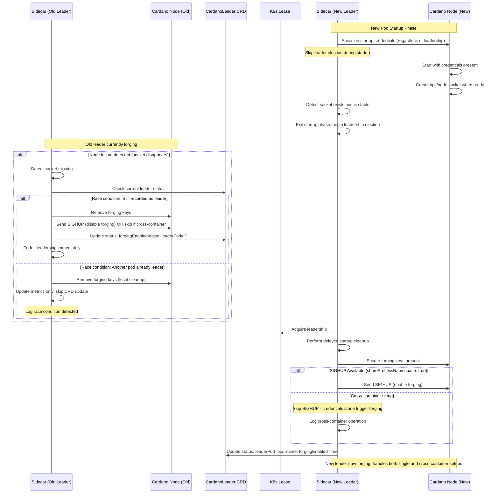
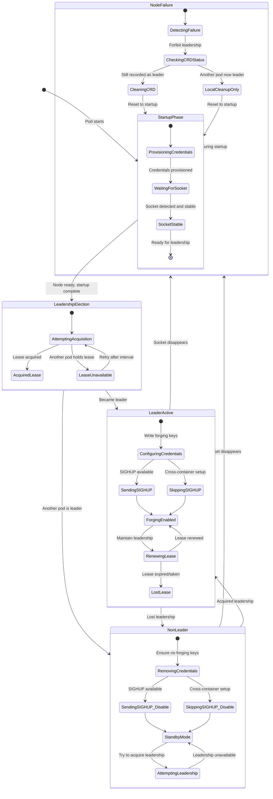

# Highly-Available Cardano Block Producer with Dynamic Forging in Kubernetes

## Overview
Cardano stake pool operators (SPOs) require high availability for block production.  
With the introduction of **dynamic block forging** in `cardano-node` (toggled via `SIGHUP` and credential files), Kubernetes can be used to manage a redundant set of producer pods where **only one is actively forging at a time**.  

This document describes the requirements, architecture, and edge cases for such a system, using Kubernetes-native primitives (e.g., `Lease`) and sidecar coordination.

---

## Goals
- Ensure **at most one active forging node** at any time to prevent duplicate block production.  
- Support **hot standbys**: all producer replicas are fully synced, ready to take over forging quickly.  
- Automate forging enable/disable using **SIGHUP signaling** and credential file presence.  
- Use **Kubernetes leader election** (`Lease` objects) for coordination.  
- Provide **observability and alerts** for leadership transitions and forging state.  
- Handle **node boot time delays** safely so that forging is not enabled prematurely.  
- Securely manage **forging credentials** in Kubernetes `Secrets`.

---

## Non-Goals
- Managing or automating key rotation.  
- Running Cardano relays (covered separately).  
~~- Cross-cluster failover (focus is within one Kubernetes cluster).~~ **[UPDATED]** - See FR9 below for cluster-wide forge management.

---

## Functional Requirements
1. **Multiple replicas** of `cardano-node` (StatefulSet), each with its own chain DB PVC.  
2. **Sidecar container** in each pod responsible for:
   - Participating in leader election (using a Kubernetes `Lease`).  
   - Writing/removing forging credential files into a shared volume.  
   - Sending `SIGHUP` to the `cardano-node` process to toggle forging.  
3. **Pod startup behavior**:
   - Node starts with `--start-as-non-producing-node`.  
   - Forging credentials are absent initially.  
   - Sidecar waits until node is fully booted (`/ipc/node.socket` exists) before participating in leader election.  
4. **Leader pod behavior**:
   - Inject forging credentials into volume.  
   - Trigger `SIGHUP` once node is confirmed booted.  
   - Maintain metrics/logs about forging state.  
5. **Non-leader pod behavior**:
   - Ensure credentials are absent.  
   - Remain fully synced, but idle (not forging).  
6. **Leader transition behavior**:
   - Old leader removes credentials and sends `SIGHUP` → node disables forging.  
   - New leader injects credentials and sends `SIGHUP` → node enables forging.  
7. **Observability**:
   - Metrics for `forging_enabled`, `leader_status`, `leadership_changes_total`.  
   - Alerts on double forging or lack of forging.  
8. **Security**:
   - Forging credentials stored only in Kubernetes `Secret`.  
   - Sidecar writes them only into the pod it manages.  
   - RBAC restricted to minimal permissions.
9. **Cluster-wide forge management** *(Extension)*:
   - Ability to globally enable/disable forging across all clusters for an SPO.
   - Support for multi-region deployments with manual failover capability.
   - Kubernetes-native management using CRD-based controls.
   - Cluster priority system for automated failover ordering.
   - Clear observability of which cluster/region is actively forging.

---

## Cluster-Wide Forge Management (Extension)

### Overview
Stake Pool Operators (SPOs) running multi-region deployments require the ability to control forging at a global level across all their Kubernetes clusters. This enables manual failover between regions, maintenance windows, and coordinated disaster recovery.

### Functional Requirements

#### FR9.1 - Global Forge Control CRD
- **CardanoForgeCluster CRD** manages forge state at cluster level
- Cluster-scoped resource that overrides local CardanoLeader behavior
- Supports states: `Enabled`, `Disabled`, `Priority-based`
- Contains cluster identification, priority, and region information

#### FR9.2 - Hierarchical Decision Making
- Local CardanoLeader CRDs check CardanoForgeCluster state before forging
- Priority order: `CardanoForgeCluster.Disabled` > `CardanoForgeCluster.Priority` > `CardanoLeader`
- If cluster forge is disabled, no local leaders can forge regardless of lease status

#### FR9.3 - Cross-Cluster Priority System
- Clusters assigned priority levels (1=highest, 999=lowest)
- Only highest priority "enabled" cluster should have active forging
- Priority ties broken by cluster creation timestamp
- Supports manual priority override for failover

#### FR9.4 - Regional Failover Support
- Clusters tagged with region/zone labels
- Manual failover by updating cluster priorities
- Automated failover based on cluster health checks (optional)
- Gradual transition support to minimize forging gaps

#### FR9.5 - Observability and Control
- Metrics: `cardano_cluster_forge_enabled{cluster="...", region="..."}` (1 or 0)
- Metrics: `cardano_cluster_forge_priority{cluster="..."}` (priority number)
- CRD status shows effective forge state and reasons
- Integration with existing pod-level metrics

### Edge Cases & Failure Modes

#### EC12 - Cross-Cluster Communication Failure
- **Problem:** Clusters cannot communicate to coordinate priority
- **Mitigation:** Each cluster makes independent decisions based on local CRD state
- **Impact:** Temporary split-brain possible during network partition
- **Detection:** Monitor for multiple clusters showing `cardano_cluster_forge_enabled=1`

#### EC13 - CRD Synchronization Lag
- **Problem:** CardanoForgeCluster updates don't propagate instantly to all pods
- **Mitigation:** Implement CRD watch with backoff retry
- **Grace Period:** Allow 30s for CRD changes to propagate before alerting
- **Fallback:** Default to disabled state if CRD cannot be read

#### EC14 - Priority Conflict Resolution
- **Problem:** Multiple clusters configured with same priority
- **Mitigation:** Use cluster creation timestamp as tiebreaker
- **Detection:** Log priority conflicts at startup
- **Manual Override:** Explicit priority assignment overrides automatic resolution

#### EC15 - Cluster Health vs Priority Mismatch
- **Problem:** Highest priority cluster is unhealthy but still enabled
- **Mitigation:** Health checks influence effective priority calculation
- **Manual Override:** SPO can force failover by changing priorities
- **Automation:** Optional automated failover based on configurable health thresholds

#### EC16 - Global Disable Race Conditions
- **Problem:** Global disable command reaches different clusters at different times
- **Mitigation:** Each cluster disables forging immediately upon receiving disable command
- **Safety:** Prefer temporary no-forging over dual-forging during transitions
- **Recovery:** Re-enable follows priority order with staggered timing

### Example CRD Structure

```yaml
apiVersion: cardano.io/v1
kind: CardanoForgeCluster
metadata:
  name: us-west-2-prod
  labels:
    cardano.io/region: us-west-2
    cardano.io/environment: production
spec:
  forgeState: Enabled  # Enabled | Disabled | Priority-based
  priority: 1          # 1=highest, 999=lowest
  healthCheck:
    enabled: true
    endpoint: "http://monitoring.example.com/cluster/health"
    interval: 30s
  override:
    reason: "Manual failover for maintenance"
    expiresAt: "2025-10-02T10:00:00Z"
status:
  effectiveState: Enabled
  lastTransition: "2025-10-02T05:43:00Z"
  activeLeader: "cardano-bp-0"
  reason: "Highest priority cluster"
  conditions:
  - type: ForgeEnabled
    status: "True"
    reason: HighestPriority
  - type: HealthCheckPassing
    status: "True"
    lastProbeTime: "2025-10-02T05:42:30Z"
```

---

## Edge Cases & Failure Modes

### 1. Premature SIGHUP (node not ready)
- **Problem:** Sidecar signals before `cardano-node` is booted and listening.  
- **Mitigation:** Sidecar waits for `/ipc/node.socket` existence before sending SIGHUP.  
- **Optional:** Use readinessProbe tied to socket file for extra safety.

### 2. Split-brain / dual leaders
- **Problem:** Multiple pods believe they are leader due to Lease timing or network partition.  
- **Mitigation:**  
  - Lease API ensures strong consistency, but rare race conditions possible.  
  - Add Prometheus alert: `sum(forging_enabled) > 1`.  
  - Optional: sidecar can verify only one leader has credentials mounted by watching the Lease holder identity.

### 3. Leader pod crashes without cleanup
- **Problem:** Sidecar crashes, leaving forging credentials present → node keeps forging even without Lease.  
- **Mitigation:**  
  - On startup, sidecar always checks: if not leader but credentials exist → delete them + send `SIGHUP`.  
  - Ensures only current leader can have credentials active.

### 4. Node restart / long boot time
- **Problem:** Node restarts due to crash or reschedule; sidecar may try to re-enable forging before node ready.  
- **Mitigation:** Sidecar blocks until `/ipc/node.socket` is recreated before signaling.  

### 5. SIGHUP also reloads topology
- **Problem:** Every `SIGHUP` reloads both credentials and topology, potentially dropping connections.  
- **Mitigation:**  
  - Expect transient network churn on failover.  
  - Relays should be configured with multiple peers to tolerate reconnections.

### 6. No leader elected
- **Problem:** All sidecars crash or Lease cannot be acquired.  
- **Impact:** No block production.  
- **Mitigation:** Alert if `sum(forging_enabled) == 0` for >60s.

### 7. Credential secret compromised
- **Problem:** Forging keys exposed.  
- **Mitigation:**  
  - Restrict RBAC to only sidecar ServiceAccount.  
  - Encrypt secrets at rest in etcd.  
  - Consider external KMS integration for higher security.

### 8. Slow PVC or database corruption
- **Problem:** Replacement leader pod takes too long to sync chain DB → forging gap.  
- **Mitigation:**  
  - Ensure fast storage class.  
  - Keep replicas running continuously so their DBs are hot.  
  - Monitor chain sync lag.

### 9. Node startup credential dependency
- **Problem:** Cardano-node requires credential files to exist at startup, even when starting with `--start-as-non-producing-node`. Without these files, node fails to start creating restart loops.
- **Mitigation:**
  - Sidecar must provision credentials during node startup phase regardless of leadership status.
  - Detect startup phase by monitoring socket file existence and stability.
  - During startup phase: provision credentials, skip leader election, don't send SIGHUP signals.
  - After startup phase completes (socket is stable): transition to normal leadership election.
  - Perform delayed startup cleanup to remove orphaned credentials if not the current leader.
  - Use startup credentials flag to track the transition between startup and normal operation phases.
  - Ensure credentials are always available during the critical node initialization period.

### 10. Cross-container process discovery failure
- **Problem:** In multi-container pods without `shareProcessNamespace: true`, the sidecar cannot discover the cardano-node process PID, preventing SIGHUP signaling. This can lead to infinite boot loops when the sidecar waits indefinitely for process discovery.
- **Mitigation:**
  - Gracefully handle process discovery failures by logging them as debug/info rather than errors.
  - Continue operation without SIGHUP signaling - credential file changes alone should trigger node behavior updates.
  - Use socket-based readiness detection as the primary mechanism instead of process discovery.
  - Add metrics to track when SIGHUP signals are skipped due to cross-container setup.
  - Document that `shareProcessNamespace: true` is recommended but not required.

### 11. Leadership forfeiture race conditions
- **Problem:** When a pod's cardano-node dies (socket disappears), the pod should forfeit leadership immediately. However, another pod might have already acquired leadership by the time the first pod detects the failure, creating a race condition where the CRD status could be incorrectly overwritten.
- **Mitigation:**
  - Before updating CRD status during leadership forfeiture, check if this pod is still recorded as the leader.
  - If another pod has already become leader, skip CRD updates but still clean up local credentials and metrics.
  - Log the race condition detection to help with debugging.
  - Ensure local state is always cleaned up regardless of CRD update results.

---

## Decision Matrix — Readiness Strategies

| Strategy                     | Description                                                   | Pros                                                     | Cons                                                       | Recommendation |
|-------------------------------|---------------------------------------------------------------|----------------------------------------------------------|------------------------------------------------------------|----------------|
| **Socket existence check**    | Sidecar waits for `/ipc/node.socket` to exist before SIGHUP   | Deterministic, lightweight, directly tied to node state  | Requires shared volume mount, only checks file existence   | ✅ Preferred — simple and reliable |
| **ReadinessProbe on socket**  | K8s readinessProbe checks `[ -S /ipc/node.socket ]`           | Integrates with Pod status, avoids custom logic          | Sidecar must poll API to read status; still needs sync gap | ✅ Good supplement to socket check |
| **Sleep delay (fixed timer)** | Sidecar sleeps N seconds before election/signaling            | Very easy to implement                                   | Fragile — node boot time varies, may fail in recovery      | ❌ Not recommended |
| **Log parsing**               | Sidecar tails node logs for “socket ready” messages           | Precise, event-driven                                    | Brittle (log format may change), adds complexity           | ⚠️ Possible fallback |
| **Metrics endpoint probing**  | Sidecar queries `/metrics` until it responds                  | Confirms full node readiness, more than just socket      | Requires HTTP port enabled and accessible in pod           | ⚠️ Useful if metrics already enabled |

---

## Sequence Diagram — Complete Leadership Lifecycle with Edge Cases



## Finite State Machine — Pod State Management



---

## Observability Requirements
- Metrics:
  - `cardano_forging_enabled{pod="..."}` (1 or 0).  
  - `cardano_leader_status{pod="..."}` (1 if leader).  
  - `cardano_leadership_changes_total`.
  - `cardano_cluster_forge_enabled{cluster="...", region="..."}` (1 or 0) - *Extension for FR9*.
  - `cardano_cluster_forge_priority{cluster="..."}` (priority number) - *Extension for FR9*.
- Alerts:
  - `sum(cardano_forging_enabled) > 1` → Critical.  
  - `sum(cardano_forging_enabled) == 0 for 60s` → Warning.
  - `sum(cardano_cluster_forge_enabled) > 1` → Critical (multi-cluster split-brain) - *Extension for FR9*.
  - `sum(cardano_cluster_forge_enabled) == 0 for 60s` → Warning (no cluster forging) - *Extension for FR9*.
- Logs:
  - Sidecar must log every leadership transition, SIGHUP sent, and credential state change.
- Leader Observation:
  - There must be a clear and observable way to determine which node is currently the elected leader.
  - It must also be observable whether the leadership action has been successfully consolidated, i.e., the credentials have been applied and the node is actively forging.
- Alternative Approach:
  - A **CardanoLeader CRD** may be implemented with status fields:
    - `leaderPod`: current leader pod name.
    - `forgingEnabled`: whether the leader node is actively forging.
    - `lastTransitionTime`: timestamp of last leadership change.
  - Sidecar updates the CRD status whenever leadership is acquired or relinquished.
  - This allows Kubernetes-native observation via `kubectl get cardanoleader -o yaml`.

### Leader Observation
- Leader identity is exposed via `cardano_leader_status` metric.
- Logs indicate if leadership action has been consolidated (credentials applied and node forging).
- Optional CRD:
  - Sidecar can update the `CardanoLeader` CRD to reflect current leader and forging state.
  - This CRD serves as an authoritative source for leadership within the cluster.
- Optional: sidecar can expose a small HTTP endpoint returning current leader pod.
---

## Security Requirements
- Secrets mounted via projected volume only into sidecar, never directly to node.  
- Sidecar copies credentials into shared emptyDir only when leader.  
- Credentials removed immediately on step-down.  
- Restrict RBAC:  
  - `get`, `update`, `create`, `watch` on `leases` (coordination.k8s.io).
  - `get` on only the specific forging secret.  
- Audit logging enabled for Secret access.

---

## Open Questions
- Should failover be **manual override only** in production, or fully automated?  
- Should we integrate external KMS for secrets rather than Kubernetes `Secret`?  
- Do we want leader election across **zones** (multi-AZ) or just within one zone?  

---

## Acceptance Criteria

### Functional Requirements Acceptance Criteria

**FR1 - Multiple Replicas Support**
- [ ] Sidecar operates correctly in StatefulSet with 2+ replicas
- [ ] Only one replica can hold leadership lease at any time
- [ ] Lease transitions work correctly between replicas

**FR2 - Sidecar Container Functionality**
- [ ] Participates in Kubernetes leader election using coordination.k8s.io/v1 Lease
- [ ] Manages forging credential files (KES, VRF, operational certificate)
- [ ] Sends SIGHUP to cardano-node process to toggle forging state
- [ ] Updates CardanoLeader CRD status with current leadership state

**FR3 - Pod Startup Behavior**
- [ ] Node starts with `--start-as-non-producing-node` flag
- [ ] Forging credentials are absent on startup
- [ ] Sidecar waits for `/ipc/node.socket` existence before leader election participation
- [ ] Socket wait has configurable timeout (default 60s)

**FR4 - Leader Pod Behavior**
- [ ] Injects forging credentials into shared volume when leader
- [ ] Sends SIGHUP to cardano-node after credential injection
- [ ] Maintains metrics showing forging_enabled=1
- [ ] Updates CRD with leaderPod=<pod-name>, forgingEnabled=true

**FR5 - Non-Leader Pod Behavior**
- [ ] Ensures forging credentials are removed from shared volume
- [ ] Sends SIGHUP to cardano-node after credential removal
- [ ] Maintains metrics showing forging_enabled=0
- [ ] Node remains synced but does not forge blocks

**FR6 - Leader Transition Behavior**
- [ ] Old leader removes credentials and sends SIGHUP before releasing lease
- [ ] New leader acquires lease, injects credentials, and sends SIGHUP
- [ ] Transition completes within one SLEEP_INTERVAL cycle
- [ ] CRD status reflects transition with updated lastTransitionTime

**FR7 - Observability Requirements**
- [ ] Exposes Prometheus metrics on port 8000:
  - `cardano_forging_enabled{pod="..."}` (1 or 0)
  - `cardano_leader_status{pod="..."}` (1 if leader, 0 if not)
  - `cardano_leadership_changes_total` (counter)
- [ ] Logs all leadership transitions with timestamps
- [ ] Logs all SIGHUP signals sent with target PID
- [ ] Logs all credential file operations

**FR8 - Security Requirements**
- [ ] Forging credentials stored only in Kubernetes Secret
- [ ] Credentials copied to shared volume only when pod is leader
- [ ] Credential files have restrictive permissions (600)
- [ ] Credentials removed immediately when leadership lost
- [ ] RBAC limited to minimal required permissions

**FR9 - Cluster-Wide Forge Management (Extension)**
- [ ] CardanoForgeCluster CRD manages forge state at cluster level
- [ ] Supports forgeState values: Enabled, Disabled, Priority-based
- [ ] Contains cluster identification, priority, and region labels
- [ ] Local CardanoLeader behavior respects cluster-wide settings
- [ ] Priority system prevents multiple clusters from forging simultaneously
- [ ] Manual failover supported via priority updates
- [ ] Health check integration influences effective priority
- [ ] Cluster-wide disable immediately stops all local forging
- [ ] Gradual transition support for maintenance scenarios
- [ ] CRD status reflects effective state and transition reasons

### Edge Cases Acceptance Criteria

**EC1 - Premature SIGHUP Prevention**
- [ ] Sidecar waits for node socket before any SIGHUP signals
- [ ] DISABLE_SOCKET_CHECK environment variable allows bypassing for testing
- [ ] Socket check has configurable timeout

**EC2 - Split-Brain Prevention**
- [ ] Handles lease API 409 conflicts gracefully
- [ ] Only lease holder can have active credentials
- [ ] Metrics allow detection of multiple forging nodes (alert: sum(cardano_forging_enabled) > 1)

**EC3 - Leader Crash Cleanup**
- [ ] On startup, removes orphaned credentials if not current lease holder
- [ ] Sends cleanup SIGHUP if credentials were removed on startup
- [ ] Verifies lease holder identity before credential operations

**EC4 - Node Restart Handling**
- [ ] Detects when node socket disappears and reappears
- [ ] Waits for socket recreation before resuming SIGHUP operations
- [ ] Maintains credential state during node restart

**EC5 - SIGHUP Topology Reload**
- [ ] Accepts that SIGHUP reloads both credentials and topology
- [ ] Logs expected transient network disruption
- [ ] Does not attempt to mitigate topology reload side effects

**EC6 - No Leader Elected Detection**
- [ ] Metrics enable alert when sum(cardano_forging_enabled) == 0 for >60s
- [ ] Logs when no leader can be elected
- [ ] Continues election attempts during outages

**EC7 - Credential Security**
- [ ] Secrets mounted read-only to sidecar container only
- [ ] Target credential files created with 0600 permissions
- [ ] No credential data logged or exposed in metrics

**EC8 - Storage/Performance**
- [ ] Operates correctly with slow or failed PVC mounts
- [ ] Handles file system errors gracefully
- [ ] Maintains hot standby readiness

**EC9 - Node Startup Credential Dependency**
- [ ] Provisions credentials during node startup phase regardless of leadership status
- [ ] Detects when cardano-node process is starting vs running
- [ ] Prevents node restart loops due to missing credential files
- [ ] Supports START_AS_NON_PRODUCING environment variable for controlled startup
- [ ] Transitions to normal leadership-based credential management after node startup
- [ ] Skips leader election during startup phase
- [ ] Performs delayed startup cleanup after node is stable
- [ ] Tracks startup credentials provisioned flag correctly

**EC10 - Cross-Container Process Discovery**
- [ ] Handles process discovery failures gracefully without infinite loops
- [ ] Continues operation when cardano-node PID cannot be discovered
- [ ] Logs cross-container setup detection appropriately (debug/info level)
- [ ] Tracks SIGHUP skip metrics when process signaling unavailable
- [ ] Uses socket-based readiness as primary detection mechanism
- [ ] Documents shareProcessNamespace recommendation but doesn't require it
- [ ] Credentials-only operation works correctly when SIGHUP unavailable

**EC11 - Leadership Forfeiture Race Conditions**
- [ ] Checks CRD status before updating during leadership forfeiture
- [ ] Skips CRD updates when another pod already became leader
- [ ] Always performs local credential cleanup regardless of CRD update status
- [ ] Logs race condition detection for debugging
- [ ] Updates local metrics even when CRD update is skipped
- [ ] Handles ApiException during CRD status checks gracefully
- [ ] Immediate leadership forfeiture when node socket disappears

**EC12 - Cross-Cluster Communication Failure (Extension)**
- [ ] Clusters make independent decisions based on local CRD state
- [ ] Temporary split-brain detection via metrics monitoring
- [ ] Network partition recovery works correctly
- [ ] Default behavior during communication failure is safe (no dual forging)

**EC13 - CRD Synchronization Lag (Extension)**
- [ ] CRD watch implemented with backoff retry mechanism
- [ ] 30 second grace period for CRD propagation
- [ ] Defaults to disabled state when CRD cannot be read
- [ ] Logs synchronization delays appropriately

**EC14 - Priority Conflict Resolution (Extension)**
- [ ] Cluster creation timestamp used as tiebreaker for equal priorities
- [ ] Priority conflicts logged at startup
- [ ] Manual priority override works correctly
- [ ] Automatic conflict resolution is deterministic

**EC15 - Cluster Health vs Priority Mismatch (Extension)**
- [ ] Health checks influence effective priority calculation
- [ ] Manual override bypasses health-based priority changes
- [ ] Automated failover respects configurable health thresholds
- [ ] Health check failures logged with appropriate severity

**EC16 - Global Disable Race Conditions (Extension)**
- [ ] Immediate forging disable upon receiving global disable command
- [ ] Prefers temporary no-forging over dual-forging during transitions
- [ ] Re-enable follows priority order with staggered timing
- [ ] Race conditions during enable/disable transitions handled safely

### Technical Acceptance Criteria

**Process Management**
- [ ] Discovers cardano-node process PID reliably
- [ ] Sends SIGHUP signals successfully
- [ ] Handles process discovery failures gracefully
- [ ] Works with shareProcessNamespace: true in pod spec

**Environment Configuration**
- [ ] All environment variables have sensible defaults
- [ ] Configuration aligns with Dockerfile environment variables
- [ ] Supports both development and production configurations

**Error Handling**
- [ ] Kubernetes API failures are logged and retried appropriately
- [ ] File system operations handle permissions and space issues
- [ ] Network failures during leader election are handled gracefully
- [ ] Invalid configurations are detected and reported clearly

**Metrics and Monitoring**
- [ ] Prometheus metrics endpoint responds on configured port
- [ ] Metrics are updated in real-time with leadership changes
- [ ] Metric labels include pod name for identification
- [ ] Metrics persist across application restarts

**Cluster-Wide Management (Extension)**
- [ ] CardanoForgeCluster CRD properly defined with OpenAPI schema
- [ ] CRD includes cluster, region, and priority labels
- [ ] CRD status subresource tracks effective state and conditions
- [ ] Forge manager watches CardanoForgeCluster CRD changes in real-time
- [ ] Hierarchical decision making: cluster state overrides local leader state
- [ ] Priority-based decision making works across multiple clusters
- [ ] Health check endpoint integration (optional) influences priorities
- [ ] Cluster-wide metrics exposed: cardano_cluster_forge_enabled, cardano_cluster_forge_priority
- [ ] RBAC includes permissions for CardanoForgeCluster CRD access
- [ ] Configuration supports cluster identification and priority settings

---

## Next Steps
1. Define StatefulSet spec with `shareProcessNamespace: true` and sidecar container.  
2. Implement sidecar leader manager (Go/Python) with:
   - Lease election.  
   - Socket readiness check (`/ipc/node.socket`).  
   - Credential inject/remove + SIGHUP.  
3. Write Prometheus metrics exporter in sidecar.  
4. Deploy in staging and validate edge cases:
   - Leader handoff.  
   - Crash recovery.  
   - Split-brain prevention.  
   - Double forging alerts.
5. **Cluster-Wide Forge Management (Extension)**:
   - Define CardanoForgeCluster CRD with OpenAPI schema.
   - Implement cluster state watching and hierarchical decision making.
   - Add cluster-wide metrics: `cardano_cluster_forge_enabled`, `cardano_cluster_forge_priority`.
   - Create example multi-region deployment configurations.
   - Implement health check integration for automated failover.
   - Test cross-cluster priority resolution and race condition handling.
   - Document SPO operational procedures for manual failover scenarios.
