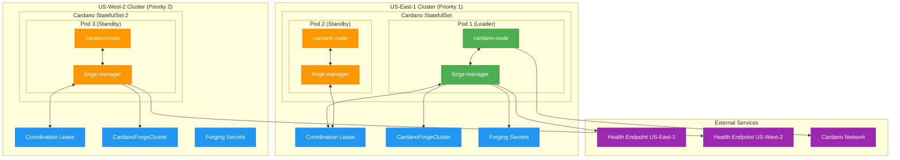
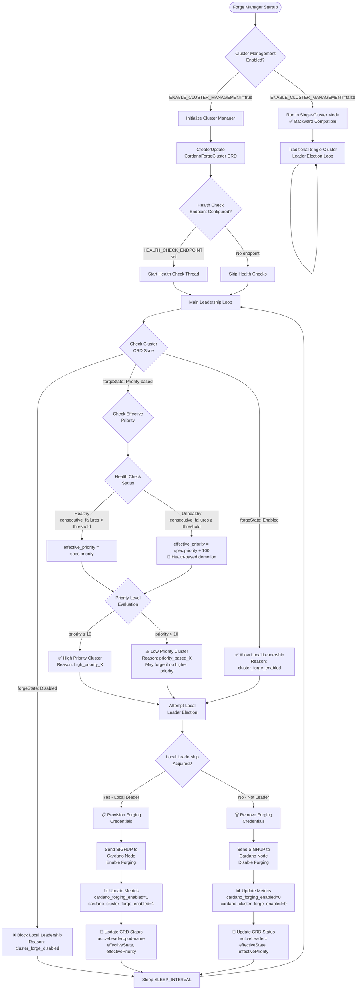
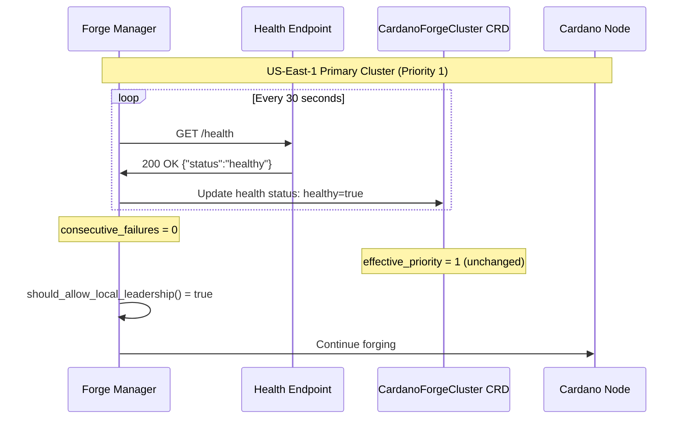
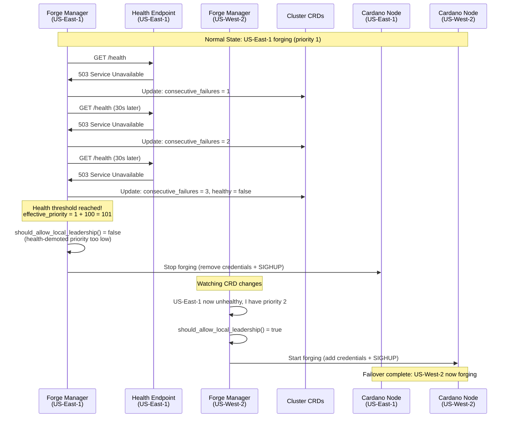

# Cardano Forge Manager - Architecture & Implementation

This document provides comprehensive technical details about the Cardano Forge Manager architecture, implementation, and multi-tenant support.

## Table of Contents

1. [System Architecture](#system-architecture)
2. [Cluster-Wide Forge Management](#cluster-wide-forge-management)
3. [Multi-Tenant Implementation](#multi-tenant-implementation)
4. [Functional Requirements](#functional-requirements)
5. [Decision Flow and Priority Logic](#decision-flow-and-priority-logic)
6. [Health Check Integration](#health-check-integration)

---

## System Architecture

### Overview

The Cardano Forge Manager implements a distributed, cluster-aware forging system that ensures exactly one active forging node across multiple geographic regions while maintaining hot standby replicas ready for instant failover.

### Core Components

#### 1. Forge Manager Sidecar
- **Purpose**: Manages leader election, credential distribution, and SIGHUP signaling
- **Language**: Python 3.13+
- **Dependencies**: kubernetes, psutil, prometheus-client, requests
- **Lifecycle**: Runs as a sidecar container alongside cardano-node

#### 2. Custom Resource Definitions (CRDs)

##### CardanoForgeCluster CRD
```yaml
apiVersion: cardano.io/v1
kind: CardanoForgeCluster
metadata:
  name: mainnet-pool1abc-us-east-1
spec:
  network:
    name: mainnet
    magic: 764824073
    era: conway
  pool:
    id: pool1abcd1234...
    idHex: "a1b2c3d4..."
    name: "My Cardano Pool"
    ticker: "POOL"
  forgeState: Priority-based  # Enabled | Disabled | Priority-based
  priority: 1                 # 1=highest, 999=lowest
  region: us-east-1
  healthCheck:
    enabled: true
    endpoint: "https://monitoring.example.com/health"
    interval: "30s"
    failureThreshold: 3
  override:
    enabled: false            # Manual failover control
```

##### Legacy CardanoLeader CRD
- Maintained for backward compatibility
- Used for local leadership election within a single cluster
- Managed automatically by forge manager

#### 3. Kubernetes Resources

##### Coordination Leases
- **Scope**: Namespace-scoped for local leadership
- **Duration**: 15 seconds (configurable)
- **Renewal**: Every 5 seconds (configurable)
- **Purpose**: Prevents multiple nodes in the same cluster from forging

##### RBAC Resources
```yaml
# Required permissions
apiGroups: ["cardano.io"]
resources: ["cardanoforgeclusters", "cardanoforgeclusters/status"]
verbs: ["get", "list", "watch", "create", "update", "patch"]

apiGroups: ["coordination.k8s.io"] 
resources: ["leases"]
verbs: ["get", "list", "watch", "create", "update", "patch", "delete"]
```

### Architecture Diagram



---

## Cluster-Wide Forge Management

### Hierarchical Decision Making

The system implements a two-tier leadership model:

1. **Local Leadership** (within cluster): Kubernetes Lease-based election
2. **Global Leadership** (cross-cluster): Priority and health-based coordination

### Priority System

#### Base Priority Assignment
- **Priority Range**: 1-999 (1 = highest priority)
- **Typical Values**:
  - Primary region: 1-10
  - Secondary regions: 11-50
  - Disaster recovery: 51-100
  - Testing/development: 101-999

#### Health-Based Priority Adjustment
```python
def calculate_effective_priority(base_priority, consecutive_failures, threshold=3):
    if consecutive_failures >= threshold:
        # Major health penalty
        return base_priority + 100
    elif consecutive_failures > 0:
        # Minor penalty for intermittent issues
        return base_priority + 10
    return base_priority
```

#### Manual Override Support
```yaml
# Temporary priority override for maintenance
override:
  enabled: true
  reason: "Planned maintenance on primary cluster"
  expiresAt: "2025-10-02T16:00:00Z"
  forcePriority: 999  # Demote to lowest priority
  forceState: Disabled
```

### State Management

#### Forge States
1. **Enabled**: Always forge (override all other conditions)
2. **Disabled**: Never forge (maintenance/emergency)
3. **Priority-based**: Follow priority and health logic (default)

#### Effective State Calculation
```python
def calculate_effective_state(spec_state, health_status, override_config):
    # Manual override has highest precedence
    if override_config.get("enabled", False):
        if not override_expired(override_config.get("expiresAt")):
            return override_config.get("forceState", spec_state)
    
    # Health-based demotion
    if spec_state == "Priority-based" and not health_status.get("healthy", True):
        return "Priority-based"  # Still priority-based, but with adjusted priority
    
    return spec_state
```

---

## Multi-Tenant Implementation

### Network and Pool Identification

#### Pool Configuration
```python
# Environment variables for multi-tenant setup
POOL_ID = "pool1abcd1234567890..."           # Bech32 pool ID
POOL_ID_HEX = "a1b2c3d4e5f6789..."         # Hex pool ID
POOL_NAME = "My Cardano Stake Pool"
POOL_TICKER = "MYPOOL"
CARDANO_NETWORK = "mainnet"                  # mainnet | preprod | preview | custom
NETWORK_MAGIC = 764824073                    # Network-specific magic
```

#### Cluster Naming Convention
```python
def get_multi_tenant_cluster_name():
    """Generate cluster name: {network}-{pool_short}-{region}"""
    if POOL_ID and CARDANO_NETWORK and CLUSTER_REGION:
        pool_short = POOL_ID[:10] if POOL_ID.startswith("pool1") else POOL_ID[:8]
        return f"{CARDANO_NETWORK}-{pool_short}-{CLUSTER_REGION}"
    else:
        # Fallback to legacy naming
        return CLUSTER_IDENTIFIER
```

#### Lease Naming Convention
```python
def get_lease_name():
    """Generate lease name: cardano-leader-{network}-{pool_short}"""
    if POOL_ID and CARDANO_NETWORK:
        pool_short = get_pool_short_id(POOL_ID)
        return f"cardano-leader-{CARDANO_NETWORK}-{pool_short}"
    else:
        return "cardano-node-leader"
```

### Validation and Compatibility

#### Configuration Validation
```python
def validate_multi_tenant_config():
    """Validate multi-tenant configuration."""
    if not ENABLE_CLUSTER_MANAGEMENT:
        return True, "cluster_management_disabled"
    
    if POOL_ID:
        # Validate pool ID format
        if not validate_pool_id(POOL_ID):
            return False, "invalid_pool_id"
        
        # Validate network configuration
        if not CARDANO_NETWORK or not CARDANO_NETWORK.strip():
            return False, "invalid_network"
        
        # Validate network magic for known networks
        known_magics = {"mainnet": 764824073, "preprod": 1, "preview": 2}
        if CARDANO_NETWORK in known_magics:
            if NETWORK_MAGIC != known_magics[CARDANO_NETWORK]:
                return False, f"network_magic_mismatch"
    
    return True, "valid_config"
```

#### Backward Compatibility
- **Legacy Mode**: When `POOL_ID` is not provided, falls back to single-tenant behavior
- **Environment Detection**: Automatically detects single-tenant vs multi-tenant configuration
- **Migration Path**: Supports gradual migration from legacy to multi-tenant setup

### Metrics and Labels

#### Multi-Tenant Metrics
```python
# Pool-specific metrics with enhanced labels
labels = {
    "pod": POD_NAME,
    "network": CARDANO_NETWORK,
    "pool_id": POOL_ID[:10] if POOL_ID else "unknown",
    "application": APPLICATION_TYPE,
    "region": CLUSTER_REGION,
}

# Cluster-wide metrics
cluster_labels = {
    "cluster": cluster_id,
    "region": region,
    "network": network,
    "pool_id": pool_id_short,
}
```

---

## Functional Requirements

### Core Functionality

#### FR1: Leader Election
- **Requirement**: Exactly one active forging node across all clusters
- **Implementation**: Two-tier coordination (local + global)
- **Validation**: Prometheus metrics and CRD status monitoring

#### FR2: Credential Management
- **Requirement**: Dynamic provisioning/removal of forging keys
- **Implementation**: File operations with proper permissions (600)
- **Security**: Source keys in read-only secret mounts

#### FR3: Process Signaling
- **Requirement**: SIGHUP signaling to cardano-node for configuration reload
- **Implementation**: Process discovery via psutil or shared process namespace
- **Fallback**: Socket-based detection for multi-container scenarios

#### FR4: Startup Safety
- **Requirement**: Prevent restart loops during node bootstrap
- **Implementation**: Startup phase detection and credential provisioning
- **Behavior**: Provision credentials during startup, begin election after socket appears

### Cluster-Wide Requirements

#### FR5: Priority-Based Failover
- **Requirement**: Highest priority healthy cluster should forge
- **Implementation**: Effective priority calculation with health adjustments
- **Override**: Manual failover support for maintenance scenarios

#### FR6: Health Check Integration
- **Requirement**: Automatic failover based on cluster health
- **Implementation**: HTTP endpoint monitoring with configurable thresholds
- **Behavior**: Health failures increase effective priority (demote cluster)

#### FR7: Multi-Tenant Support
- **Requirement**: Support multiple pools in the same Kubernetes cluster
- **Implementation**: Pool and network identification in resource names
- **Isolation**: Separate leases and CRDs per pool/network combination

### Operational Requirements

#### FR8: Observability
- **Metrics**: Comprehensive Prometheus metrics for monitoring
- **Logging**: Structured logging with appropriate levels
- **Status**: Real-time status updates in CRD resources

#### FR9: RBAC Security
- **Principle**: Least privilege access
- **Permissions**: Minimal required API access (leases + CRDs)
- **Isolation**: Namespace-scoped where possible

#### FR10: Backward Compatibility
- **Legacy Support**: Single-tenant deployments continue to work
- **Migration**: Gradual upgrade path to cluster-aware forging
- **Configuration**: Environment-based feature detection

---

## Decision Flow and Priority Logic

### Main Control Loop

```python
def main_control_loop():
    while True:
        try:
            # Check if node is in startup phase
            in_startup = is_node_in_startup_phase()
            
            if in_startup:
                # Provision startup credentials, skip election
                provision_startup_credentials()
                time.sleep(SLEEP_INTERVAL)
                continue
            
            # Check cluster-wide leadership permission
            allowed, reason = cluster_manager.should_allow_local_leadership()
            
            if not allowed:
                # Remove credentials and skip local election
                ensure_secrets(is_leader=False)
                logger.info(f"Local leadership blocked: {reason}")
                time.sleep(SLEEP_INTERVAL)
                continue
            
            # Attempt local leader election
            is_leader = try_acquire_leader()
            
            # Manage credentials based on leadership
            ensure_secrets(is_leader)
            
            # Update status and metrics
            update_leader_status(is_leader)
            update_metrics(is_leader)
            
            time.sleep(SLEEP_INTERVAL)
            
        except Exception as e:
            logger.error(f"Error in main loop: {e}")
            time.sleep(min(SLEEP_INTERVAL * 2, 30))
```

### Cluster Leadership Logic



---

## Health Check Integration

### Health Endpoint Configuration

#### Implementation Options

**Option A: Prometheus-Based Health API**
```python
@app.route('/api/v1/health/cluster/<cluster_name>')
def health_check(cluster_name):
    # Check cardano-node is up and syncing
    node_up = check_prometheus_metric(f'up{{job="cardano-node",cluster="{cluster_name}"}}')
    sync_status = check_prometheus_metric(f'cardano_node_metrics_slotInEpoch_int{{cluster="{cluster_name}"}}')
    
    # Check system resources
    cpu_usage = check_prometheus_metric(f'cpu_usage{{cluster="{cluster_name}"}}')
    memory_usage = check_prometheus_metric(f'memory_usage{{cluster="{cluster_name}"}}')
    
    # Aggregate health determination
    overall_healthy = all([
        node_up and sync_status,
        cpu_usage < 90,
        memory_usage < 90,
    ])
    
    status_code = 200 if overall_healthy else 503
    return {
        "status": "healthy" if overall_healthy else "unhealthy",
        "cluster": cluster_name,
        "timestamp": datetime.utcnow().isoformat(),
        "checks": {
            "node_up": node_up,
            "cpu_usage": cpu_usage,
            "memory_usage": memory_usage,
        }
    }, status_code
```

**Option B: Kubernetes Native Health Check**
```yaml
apiVersion: apps/v1
kind: Deployment
metadata:
  name: cluster-health-aggregator
spec:
  template:
    spec:
      containers:
      - name: health-check
        image: health-aggregator:latest
        ports:
        - containerPort: 8080
        env:
        - name: CLUSTER_NAME
          value: "us-east-1-prod"
        livenessProbe:
          httpGet:
            path: /health
            port: 8080
        readinessProbe:
          httpGet:
            path: /ready
            port: 8080
```

### Health-Based Priority Adjustment

```python
def _get_health_adjusted_priority(self) -> int:
    base_priority = self.priority
    
    # Health-based adjustments
    if self._consecutive_health_failures >= 3:
        # Demote unhealthy clusters by adding penalty
        health_penalty = 100
        logger.warning(f"Cluster unhealthy, adding priority penalty: {health_penalty}")
        return base_priority + health_penalty
    
    elif self._consecutive_health_failures >= 1:
        # Minor penalty for intermittent issues
        minor_penalty = 10
        return base_priority + minor_penalty
    
    # Healthy cluster uses base priority
    return base_priority
```

### Health Check Scenarios

#### Normal Operation


#### Health Degradation and Failover


### Metrics Integration

```prometheus
# Health check success/failure rate
cardano_cluster_health_check_success{cluster="us-east-1-prod"} 1

# Consecutive failure count
cardano_cluster_health_check_consecutive_failures{cluster="us-east-1-prod"} 0

# Response time monitoring  
cardano_cluster_health_check_duration_seconds{cluster="us-east-1-prod"} 0.045

# Last successful health check timestamp
cardano_cluster_health_check_last_success_timestamp{cluster="us-east-1-prod"} 1696234511
```

---

This comprehensive architecture document provides the technical foundation for understanding and implementing the Cardano Forge Manager cluster-aware forging system. The design emphasizes reliability, observability, and operational simplicity while maintaining backward compatibility with existing single-cluster deployments.