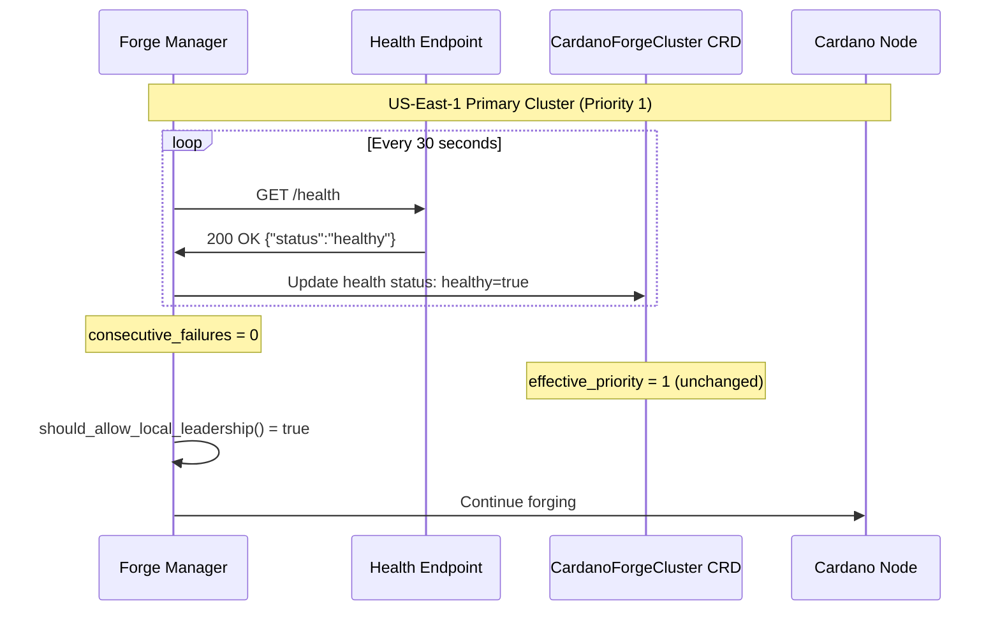
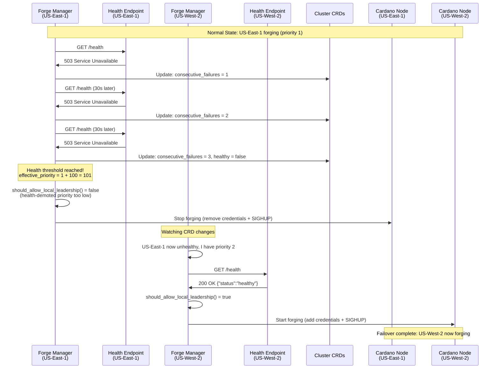
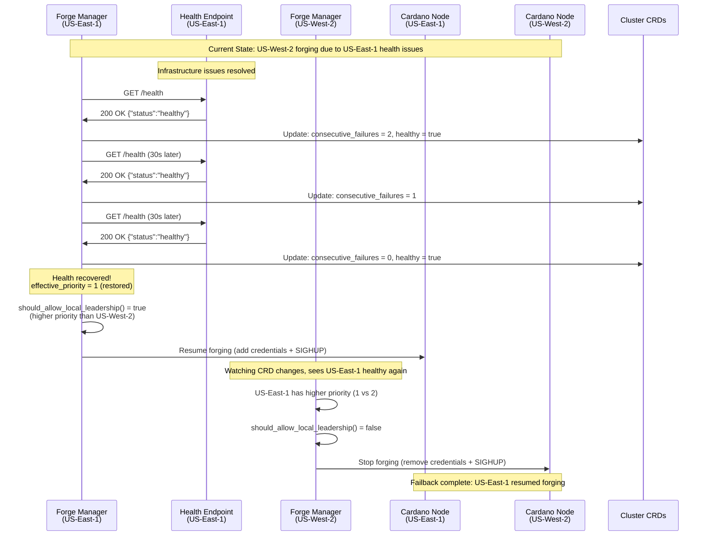

# Health Check Endpoint - Cluster-Wide Forge Management

## Overview

The `HEALTH_CHECK_ENDPOINT` is a critical component of the cluster-wide forge management system that enables automated failover based on cluster health status. It provides a way for each cluster to report its health status, which is then used to influence forging priorities and enable automatic disaster recovery.

## Purpose and Benefits

### Primary Functions
1. **Automated Failover**: Automatically demote unhealthy clusters from forging
2. **Health Monitoring**: Continuous monitoring of cluster infrastructure health
3. **Priority Adjustment**: Dynamic priority adjustments based on health status
4. **Early Warning**: Detect issues before they cause forging failures

### Business Benefits for SPOs
- **Reduced Downtime**: Automatic failover to healthy clusters
- **Improved Reliability**: Proactive detection of infrastructure issues
- **Operational Efficiency**: Reduced need for manual intervention
- **Better Observability**: Clear health status across all regions

---

## Configuration and Setup

### Environment Variables

The health check system is configured through environment variables:

```bash
# Enable cluster management (required)
ENABLE_CLUSTER_MANAGEMENT=true

# Health check endpoint URL (optional)
HEALTH_CHECK_ENDPOINT=https://monitoring.example.com/api/v1/health/cluster/us-east-1

# Health check interval in seconds (default: 30)
HEALTH_CHECK_INTERVAL=30
```

### Helm Configuration

```yaml
# values.yaml
forgeManager:
  clusterManagement:
    enabled: true
    healthCheck:
      enabled: true
      endpoint: "https://monitoring.example.com/api/v1/health/cluster/us-east-1"
      interval: 30  # seconds
      timeout: 10   # seconds
      failureThreshold: 3  # consecutive failures before marking unhealthy
```

### CRD Configuration

The health check configuration is also stored in the CardanoForgeCluster CRD:

```yaml
apiVersion: cardano.io/v1
kind: CardanoForgeCluster
metadata:
  name: us-east-1-prod
spec:
  # ... other configuration ...
  healthCheck:
    enabled: true
    endpoint: "https://monitoring.example.com/api/v1/health/cluster/us-east-1"
    interval: "30s"
    timeout: "10s"
    failureThreshold: 3
```

---

## Health Check Endpoint Implementation

### Expected Response Format

The health check endpoint should return a JSON response with HTTP status codes:

#### Healthy Response (HTTP 200)
```json
{
  "status": "healthy",
  "timestamp": "2025-10-02T06:45:11Z",
  "cluster": "us-east-1-prod",
  "checks": {
    "database": "healthy",
    "networking": "healthy",
    "storage": "healthy",
    "cardano_node": "healthy"
  },
  "metrics": {
    "cpu_usage": 45.2,
    "memory_usage": 67.8,
    "disk_usage": 23.1,
    "network_latency_ms": 12
  }
}
```

#### Unhealthy Response (HTTP 503)
```json
{
  "status": "unhealthy",
  "timestamp": "2025-10-02T06:45:11Z",
  "cluster": "us-east-1-prod",
  "checks": {
    "database": "healthy",
    "networking": "unhealthy",
    "storage": "healthy", 
    "cardano_node": "degraded"
  },
  "errors": [
    "High network latency detected: 250ms",
    "Cardano node sync lag: 5 minutes behind"
  ]
}
```

### Sample Implementation Options

#### Option 1: Prometheus-based Health Check

```python
# health_check_server.py
from flask import Flask, jsonify
import requests
import time

app = Flask(__name__)

@app.route('/api/v1/health/cluster/<cluster_name>')
def health_check(cluster_name):
    try:
        # Query Prometheus for cluster health metrics
        prometheus_url = "http://prometheus:9090/api/v1/query"
        
        checks = {}
        overall_healthy = True
        
        # Check Cardano node is running
        node_query = f'up{{job="cardano-node",cluster="{cluster_name}"}}'
        node_result = requests.get(prometheus_url, params={'query': node_query})
        node_up = float(node_result.json()['data']['result'][0]['value'][1]) == 1
        checks['cardano_node'] = 'healthy' if node_up else 'unhealthy'
        overall_healthy &= node_up
        
        # Check node sync status
        sync_query = f'cardano_node_metrics_slotInEpoch_int{{cluster="{cluster_name}"}}'
        sync_result = requests.get(prometheus_url, params={'query': sync_query})
        # ... sync check logic ...
        
        # Check system resources
        cpu_query = f'100 - (avg(rate(node_cpu_seconds_total{{mode="idle",cluster="{cluster_name}"}}[5m])) * 100)'
        cpu_result = requests.get(prometheus_url, params={'query': cpu_query})
        cpu_usage = float(cpu_result.json()['data']['result'][0]['value'][1])
        checks['system'] = 'healthy' if cpu_usage < 80 else 'degraded'
        
        status_code = 200 if overall_healthy else 503
        return jsonify({
            'status': 'healthy' if overall_healthy else 'unhealthy',
            'timestamp': time.strftime('%Y-%m-%dT%H:%M:%SZ', time.gmtime()),
            'cluster': cluster_name,
            'checks': checks,
            'metrics': {
                'cpu_usage': cpu_usage
            }
        }), status_code
        
    except Exception as e:
        return jsonify({
            'status': 'error',
            'error': str(e),
            'cluster': cluster_name
        }), 500

if __name__ == '__main__':
    app.run(host='0.0.0.0', port=8080)
```

#### Option 2: Kubernetes-native Health Check

```yaml
# health-check-deployment.yaml
apiVersion: apps/v1
kind: Deployment
metadata:
  name: cluster-health-check
spec:
  replicas: 1
  selector:
    matchLabels:
      app: cluster-health-check
  template:
    metadata:
      labels:
        app: cluster-health-check
    spec:
      containers:
      - name: health-check
        image: nginx:alpine
        ports:
        - containerPort: 80
        volumeMounts:
        - name: health-config
          mountPath: /etc/nginx/conf.d
        livenessProbe:
          httpGet:
            path: /health
            port: 80
          initialDelaySeconds: 30
          periodSeconds: 10
      volumes:
      - name: health-config
        configMap:
          name: health-check-config
---
apiVersion: v1
kind: ConfigMap
metadata:
  name: health-check-config
data:
  default.conf: |
    server {
        listen 80;
        location /health {
            access_log off;
            return 200 '{"status":"healthy","cluster":"us-east-1-prod"}';
            add_header Content-Type application/json;
        }
    }
---
apiVersion: v1
kind: Service
metadata:
  name: cluster-health-check
spec:
  selector:
    app: cluster-health-check
  ports:
  - port: 80
    targetPort: 80
```

#### Option 3: External Monitoring System

Many SPOs use external monitoring systems like:
- **Grafana Cloud**: Custom webhook endpoint
- **DataDog**: Synthetic monitoring with API endpoint
- **New Relic**: Infrastructure monitoring with health API
- **Custom Monitoring**: Existing monitoring infrastructure

---

## How It Works - Technical Deep Dive

### Health Check Flow

1. **Initialization**: Forge manager starts health check thread if `HEALTH_CHECK_ENDPOINT` is configured
2. **Periodic Checks**: HTTP GET request sent to endpoint every `HEALTH_CHECK_INTERVAL` seconds
3. **Response Evaluation**: HTTP 200 = healthy, anything else = unhealthy
4. **Failure Tracking**: Consecutive failures counted up to `failureThreshold`
5. **CRD Updates**: Health status updated in CardanoForgeCluster CRD
6. **Priority Impact**: Unhealthy clusters may have reduced effective priority

### Health Status Impact on Forging

```python
# Simplified logic from cluster_manager.py
def should_allow_local_leadership(self) -> Tuple[bool, str]:
    if not self.enabled:
        return True, "cluster_management_disabled"
    
    # Check CRD state
    effective_state = self._current_cluster_crd.get("status", {}).get("effectiveState")
    
    if effective_state == "Disabled":
        return False, "cluster_forge_disabled"
    
    if effective_state == "Enabled":
        return True, "cluster_forge_enabled"
    
    # Priority-based with health consideration
    if effective_state == "Priority-based":
        effective_priority = self._get_health_adjusted_priority()
        
        # Health issues increase effective priority (lower priority)
        if self._consecutive_health_failures >= self._failure_threshold:
            effective_priority += 100  # Demote unhealthy cluster
        
        return self._should_forge_with_priority(effective_priority)
```

### Health Check Thread Management

```python
def _health_check_loop(self):
    """Perform periodic health checks."""
    while not self._shutdown_event.is_set():
        try:
            self._perform_health_check()
            
            # Wait for next interval or shutdown
            if self._shutdown_event.wait(HEALTH_CHECK_INTERVAL):
                break
        except Exception as e:
            logger.error(f"Health check loop error: {e}")
            time.sleep(5)

def _perform_health_check(self):
    """Perform a single health check."""
    try:
        response = requests.get(
            HEALTH_CHECK_ENDPOINT,
            timeout=10,
            headers={"User-Agent": "cardano-forge-manager/1.0"}
        )
        
        healthy = response.status_code == 200
        self._update_health_status(healthy, response.text[:100])
        
    except requests.RequestException as e:
        self._consecutive_health_failures += 1
        self._update_health_status(False, str(e))
```

---

## Architecture Diagram

```mermaid
graph TB
    subgraph "Multi-Region Cardano SPO Infrastructure"
        subgraph "US-East-1 Cluster (Primary)"
            subgraph "us-east-1-pod"
                CN1[Cardano Node]
                FM1[Forge Manager]
                FM1 --> CN1
            end
            
            subgraph "Monitoring"
                HE1[Health Endpoint<br/>:8080/health]
                PROM1[Prometheus]
                GRAF1[Grafana]
                HE1 --> PROM1
                PROM1 --> GRAF1
            end
        end
        
        subgraph "US-West-2 Cluster (Secondary)"
            subgraph "us-west-2-pod"
                CN2[Cardano Node]
                FM2[Forge Manager]
                FM2 --> CN2
            end
            
            subgraph "Monitoring"
                HE2[Health Endpoint<br/>:8080/health]
                PROM2[Prometheus]
                GRAF2[Grafana]
                HE2 --> PROM2
                PROM2 --> GRAF2
            end
        end
        
        subgraph "EU-West-1 Cluster (Tertiary)"
            subgraph "eu-west-1-pod"
                CN3[Cardano Node]
                FM3[Forge Manager]
                FM3 --> CN3
            end
            
            subgraph "Monitoring"
                HE3[Health Endpoint<br/>:8080/health]
                PROM3[Prometheus]
                GRAF3[Grafana]
                HE3 --> PROM3
                PROM3 --> GRAF3
            end
        end
    end
    
    subgraph "Kubernetes API"
        CRD1[(CardanoForgeCluster<br/>us-east-1-prod)]
        CRD2[(CardanoForgeCluster<br/>us-west-2-prod)]
        CRD3[(CardanoForgeCluster<br/>eu-west-1-prod)]
        LEASE[Lease Objects]
    end
    
    subgraph "External Services"
        CARDANO[Cardano Network]
        MONITOR[External Monitoring<br/>monitoring.example.com]
    end
    
    %% Health Check Flow
    FM1 -.->|HTTP GET every 30s| HE1
    FM2 -.->|HTTP GET every 30s| HE2
    FM3 -.->|HTTP GET every 30s| HE3
    
    %% CRD Updates
    FM1 --> CRD1
    FM2 --> CRD2
    FM3 --> CRD3
    
    %% CRD Watching
    FM1 -.->|Watch| CRD1
    FM1 -.->|Watch| CRD2
    FM1 -.->|Watch| CRD3
    
    FM2 -.->|Watch| CRD1
    FM2 -.->|Watch| CRD2
    FM2 -.->|Watch| CRD3
    
    FM3 -.->|Watch| CRD1
    FM3 -.->|Watch| CRD2
    FM3 -.->|Watch| CRD3
    
    %% Leadership Election
    FM1 --> LEASE
    FM2 --> LEASE
    FM3 --> LEASE
    
    %% Block Production (only from active leader)
    CN1 -->|Blocks| CARDANO
    
    %% External Monitoring Integration
    HE1 -.->|Optional| MONITOR
    HE2 -.->|Optional| MONITOR
    HE3 -.->|Optional| MONITOR
    
    %% Styling
    classDef primary fill:#e1f5fe
    classDef secondary fill:#f3e5f5
    classDef tertiary fill:#e8f5e8
    classDef monitoring fill:#fff3e0
    classDef k8s fill:#fce4ec
    classDef external fill:#f1f8e9
    
    class CN1,FM1,HE1,PROM1,GRAF1,CRD1 primary
    class CN2,FM2,HE2,PROM2,GRAF2,CRD2 secondary
    class CN3,FM3,HE3,PROM3,GRAF3,CRD3 tertiary
    class LEASE k8s
    class CARDANO,MONITOR external
```



## Health Check Scenarios and Behavior

### Scenario 1: Normal Operation


### Scenario 2: Health Degradation and Failover


### Scenario 3: Recovery and Failback


---

## Monitoring and Alerting Integration

### Prometheus Metrics for Health Checks

The forge manager exposes additional metrics for health check monitoring:

```prometheus
# Health check status per cluster
cardano_cluster_health_check_success{cluster="us-east-1-prod"} 1
cardano_cluster_health_check_consecutive_failures{cluster="us-east-1-prod"} 0
cardano_cluster_health_check_last_success_timestamp{cluster="us-east-1-prod"} 1696234511

# Response time metrics
cardano_cluster_health_check_duration_seconds{cluster="us-east-1-prod"} 0.045
```

### Recommended Alerting Rules

```yaml
groups:
- name: cardano-health-checks
  rules:
  # Critical: Health check endpoint down
  - alert: CardanoClusterHealthCheckDown
    expr: cardano_cluster_health_check_success == 0
    for: 2m
    labels:
      severity: critical
    annotations:
      summary: "Cluster {{ $labels.cluster }} health check failing"
      description: "Health check endpoint has been failing for {{ $labels.cluster }}"

  # Warning: Health check response slow  
  - alert: CardanoClusterHealthCheckSlow
    expr: cardano_cluster_health_check_duration_seconds > 5
    for: 5m
    labels:
      severity: warning
    annotations:
      summary: "Cluster {{ $labels.cluster }} health check response slow"
      description: "Health check taking {{ $value }}s to respond"

  # Info: Cluster failover occurred
  - alert: CardanoClusterFailover
    expr: changes(cardano_cluster_forge_enabled[10m]) > 0
    for: 0m
    labels:
      severity: info
    annotations:
      summary: "Cardano cluster failover detected"
      description: "Active forging cluster changed in the last 10 minutes"
```

---

## Best Practices and Recommendations

### Health Endpoint Implementation

1. **Keep it Simple**: Health check should be lightweight and fast (<1 second response time)
2. **Include Key Dependencies**: Check critical services (database, cardano-node, networking)
3. **Avoid Cascading Failures**: Don't let one unhealthy dependency fail the entire health check
4. **Return Meaningful Data**: Include specific error details for debugging
5. **Implement Caching**: Cache expensive checks to avoid overwhelming dependencies

### Monitoring Strategy

1. **Multi-Layer Monitoring**: 
   - Infrastructure (CPU, memory, disk, network)
   - Application (cardano-node metrics, sync status)
   - Business (block production, slot leadership)

2. **Regional Considerations**:
   - Different latency expectations per region
   - Time zone aware alerting
   - Regional escalation procedures

3. **Alert Fatigue Prevention**:
   - Appropriate thresholds and delays
   - Smart grouping and routing
   - Automated remediation where possible

### Security Considerations

1. **Endpoint Security**: 
   - Use HTTPS with proper certificates
   - Implement authentication if exposing externally
   - Rate limiting to prevent abuse

2. **Network Security**:
   - Firewall rules allowing forge manager access
   - VPN or private networking for cross-region health checks
   - Monitor for unauthorized access attempts

3. **Data Privacy**:
   - Avoid exposing sensitive information in health responses
   - Log health check access appropriately
   - Regular security audits of health endpoints

---

## Troubleshooting Health Check Issues

### Common Problems

#### 1. Health Check Endpoint Not Responding
```bash
# Test manually from forge manager pod
kubectl exec statefulset/cardano-node -c forge-manager -- \
  curl -v -m 10 "${HEALTH_CHECK_ENDPOINT}"

# Check DNS resolution
kubectl exec statefulset/cardano-node -c forge-manager -- \
  nslookup monitoring.example.com
```

#### 2. SSL/TLS Certificate Issues
```bash
# Test with detailed SSL info
kubectl exec statefulset/cardano-node -c forge-manager -- \
  curl -vvv --connect-timeout 5 "${HEALTH_CHECK_ENDPOINT}"

# Skip certificate validation temporarily (not for production)
kubectl exec statefulset/cardano-node -c forge-manager -- \
  curl -k "${HEALTH_CHECK_ENDPOINT}"
```

#### 3. Network Connectivity Issues
```bash
# Test basic connectivity
kubectl exec statefulset/cardano-node -c forge-manager -- \
  nc -zv monitoring.example.com 443

# Check routing
kubectl exec statefulset/cardano-node -c forge-manager -- \
  traceroute monitoring.example.com
```

#### 4. False Positive Health Failures
- **Cause**: Health endpoint too strict, failing on minor issues
- **Solution**: Review health check criteria, implement degraded vs failed states
- **Mitigation**: Increase failure threshold or implement exponential backoff

### Debug Commands

```bash
# Check current health status in CRD
kubectl get cardanoforgeCluster us-east-1-prod -o jsonpath='{.status.healthStatus}'

# View health check logs
kubectl logs statefulset/cardano-node -c forge-manager | grep -i health

# Monitor health check metrics
kubectl port-forward statefulset/cardano-node 8000:8000
curl http://localhost:8000/metrics | grep health_check
```

---

The HEALTH_CHECK_ENDPOINT functionality provides SPOs with a powerful tool for automated cluster health management, enabling truly hands-off multi-region operations with automatic failover and recovery capabilities.
