# Implementation Notes

This document consolidates technical implementation details for the Cardano Forge Manager.

---

# Part 1: Startup Probe Implementation for Cardano Forge Manager

## Overview

This document explains the startup synchronization mechanism implemented to ensure the cardano-node container starts only after the Cardano Forge Manager has successfully provisioned the required credentials (KES key, VRF key, and operational certificate).

## Problem Statement

The cardano-node requires specific credential files to be present at startup:
- `/opt/cardano/secrets/kes.skey` (KES signing key)
- `/opt/cardano/secrets/vrf.skey` (VRF signing key) 
- `/opt/cardano/secrets/node.cert` (Operational certificate)

Without these files, the cardano-node container will crash and restart continuously, creating a restart loop that prevents the pod from becoming ready.

## Solution Architecture

### Native Sidecar Pattern with Startup Probes

We use Kubernetes native sidecars (available in K8s 1.29+) with startup probes to ensure proper initialization order:

1. **Init Containers** run first (setup directories, download genesis files)
2. **Sidecar Containers** (forge manager) start and must pass their startup probes
3. **Main Containers** (cardano-node) start only after all sidecar startup probes succeed

### Components

#### 1. Forge Manager HTTP Server

The forge manager runs an HTTP server on port 8000 with multiple endpoints:

- `/startup-status` - Returns startup credential status (for startup probe)
- `/metrics` - Prometheus metrics (existing functionality)  
- `/health` - Simple health check

#### 2. Startup Status Endpoint (`/startup-status`)

**Ready State (HTTP 200):**
```json
{
  \"status\": \"ready\",
  \"message\": \"Startup credentials provisioned successfully\",
  \"credentials_provisioned\": true,
  \"timestamp\": \"2025-10-13T01:15:00Z\"
}
```

**Not Ready State (HTTP 503):**
```json
{
  \"status\": \"not_ready\",
  \"message\": \"Startup credentials not yet provisioned\",
  \"credentials_provisioned\": false,
  \"timestamp\": \"2025-10-13T01:15:00Z\"
}
```

#### 3. Startup Readiness Logic

The endpoint returns HTTP 200 (ready) when:
1. The `startup_credentials_provisioned` flag is `True`, OR
2. All required credential files exist and are non-empty:
   - `/opt/cardano/secrets/kes.skey`
   - `/opt/cardano/secrets/vrf.skey`
   - `/opt/cardano/secrets/node.cert`

#### 4. Startup Probe Configuration

The forge manager sidecar has a startup probe configured:

```yaml
startupProbe:
  httpGet:
    path: /startup-status
    port: 8000
  initialDelaySeconds: 5    # Start checking quickly
  periodSeconds: 3          # Check every 3 seconds
  timeoutSeconds: 2         # 2 second timeout
  failureThreshold: 60      # Allow up to 3 minutes (60 * 3s = 180s)
  successThreshold: 1       # Only need one success
```

## Configuration

### Enabling Startup Probes

Startup probes are enabled by default when the forge manager is enabled:

```yaml
# values.yaml
healthChecks:
  forgeManager:
    startupProbe:
      enabled: true  # Enabled by default
      httpGet:
        path: /startup-status
        port: 8000
      initialDelaySeconds: 5
      periodSeconds: 3
      timeoutSeconds: 2
      failureThreshold: 60
      successThreshold: 1
```

### Customizing Startup Probe Timing

You can adjust the timing parameters based on your environment:

```yaml
healthChecks:
  forgeManager:
    startupProbe:
      initialDelaySeconds: 10   # Wait 10s before first check
      periodSeconds: 5          # Check every 5 seconds  
      failureThreshold: 36      # Allow 3 minutes (36 * 5s = 180s)
```

### Disabling Startup Probes

If you need to disable startup probes (not recommended):

```yaml
healthChecks:
  forgeManager:
    startupProbe:
      enabled: false
```

## Benefits

1. **Eliminates Restart Loops**: cardano-node won't start until credentials are ready
2. **Faster Startup**: No wasted time on failed container starts
3. **Clear Status Visibility**: Easy to monitor startup progress via HTTP endpoint
4. **Configurable Timeouts**: Adjustable for different network/storage conditions
5. **Backward Compatible**: Works alongside existing health checks

## Monitoring and Troubleshooting

### Check Startup Status

You can manually check the startup status:

```bash
# Port forward to forge manager
kubectl port-forward pod/cardano-node-0 8000:8000

# Check startup status
curl http://localhost:8000/startup-status

# Check other endpoints
curl http://localhost:8000/health
curl http://localhost:8000/metrics
```

### View Startup Probe Events

```bash
# Check pod events for startup probe status
kubectl describe pod cardano-node-0

# Check container status
kubectl get pod cardano-node-0 -o jsonpath='{.status.containerStatuses[?(@.name==\"cardano-forge-manager\")].ready}'
```

### Common Issues

**Startup probe timeout:**
- Increase `failureThreshold` or `periodSeconds`
- Check forge manager logs: `kubectl logs cardano-node-0 -c cardano-forge-manager`
- Verify secret volume is mounted correctly

**Credentials not provisioned:**
- Check that the secret exists: `kubectl get secret cardano-secrets`
- Verify source file paths in forge manager configuration
- Check file permissions on source files

**HTTP endpoint not responding:**
- Verify forge manager container is running
- Check that port 8000 is not blocked
- Review forge manager startup logs

## Testing

Use the provided test script to verify endpoint functionality:

```bash
# Test locally (if running forge manager locally)
python3 test-startup-endpoint.py localhost 8000

# Test in cluster via port-forward
kubectl port-forward pod/cardano-node-0 8000:8000
python3 test-startup-endpoint.py localhost 8000
```

## Implementation Details

### Code Changes

1. **HTTP Server Enhancement** (`forgemanager.py`):
   - Added custom HTTP handler with multiple endpoints
   - Implemented startup status checking logic
   - Added health endpoint for other probes

2. **Helm Chart Updates** (`statefulset.yaml`):
   - Added startup probe configuration to forge manager container
   - Added readiness and liveness probe support

3. **Configuration** (`values.yaml`):
   - Added `healthChecks.forgeManager` section
   - Configurable probe parameters

### Native Sidecar Requirements

- Kubernetes 1.29+ for native sidecar support
- `restartPolicy: Always` on sidecar containers
- Startup probes prevent main container startup until sidecars are ready

## References

- [Kubernetes Startup Probes](https://kubernetes.io/docs/concepts/workloads/pods/pod-lifecycle/#startup-probes)
- [Kubernetes Native Sidecars](https://kubernetes.io/docs/concepts/workloads/pods/init-containers/#sidecar-containers)
- [Cardano Forge Manager Documentation](./WARP.md)# Health Check Endpoint - Cluster-Wide Forge Management

## Overview

The `HEALTH_CHECK_ENDPOINT` is a critical component of the cluster-wide forge management system that enables automated failover based on cluster health status. It provides a way for each cluster to report its health status, which is then used to influence forging priorities and enable automatic disaster recovery.

## Purpose and Benefits

### Primary Functions
1. **Automated Failover**: Automatically demote unhealthy clusters from forging
2. **Health Monitoring**: Continuous monitoring of cluster infrastructure health
3. **Priority Adjustment**: Dynamic priority adjustments based on health status
4. **Early Warning**: Detect issues before they cause forging failures

### Business Benefits for SPOs
- **Reduced Downtime**: Automatic failover to healthy clusters
- **Improved Reliability**: Proactive detection of infrastructure issues
- **Operational Efficiency**: Reduced need for manual intervention
- **Better Observability**: Clear health status across all regions

---

## Configuration and Setup

### Environment Variables

The health check system is configured through environment variables:

```bash
# Enable cluster management (required)
ENABLE_CLUSTER_MANAGEMENT=true

# Health check endpoint URL (optional)
HEALTH_CHECK_ENDPOINT=https://monitoring.example.com/api/v1/health/cluster/us-east-1

# Health check interval in seconds (default: 30)
HEALTH_CHECK_INTERVAL=30
```

### Helm Configuration

```yaml
# values.yaml
forgeManager:
  clusterManagement:
    enabled: true
    healthCheck:
      enabled: true
      endpoint: "https://monitoring.example.com/api/v1/health/cluster/us-east-1"
      interval: 30  # seconds
      timeout: 10   # seconds
      failureThreshold: 3  # consecutive failures before marking unhealthy
```

### CRD Configuration

The health check configuration is also stored in the CardanoForgeCluster CRD:

```yaml
apiVersion: cardano.io/v1
kind: CardanoForgeCluster
metadata:
  name: us-east-1-prod
spec:
  # ... other configuration ...
  healthCheck:
    enabled: true
    endpoint: "https://monitoring.example.com/api/v1/health/cluster/us-east-1"
    interval: "30s"
    timeout: "10s"
    failureThreshold: 3
```

---

---

# Part 2: Health Check Endpoint Implementation

### Expected Response Format

The health check endpoint should return a JSON response with HTTP status codes:

#### Healthy Response (HTTP 200)
```json
{
  "status": "healthy",
  "timestamp": "2025-10-02T06:45:11Z",
  "cluster": "us-east-1-prod",
  "checks": {
    "database": "healthy",
    "networking": "healthy",
    "storage": "healthy",
    "cardano_node": "healthy"
  },
  "metrics": {
    "cpu_usage": 45.2,
    "memory_usage": 67.8,
    "disk_usage": 23.1,
    "network_latency_ms": 12
  }
}
```

#### Unhealthy Response (HTTP 503)
```json
{
  "status": "unhealthy",
  "timestamp": "2025-10-02T06:45:11Z",
  "cluster": "us-east-1-prod",
  "checks": {
    "database": "healthy",
    "networking": "unhealthy",
    "storage": "healthy", 
    "cardano_node": "degraded"
  },
  "errors": [
    "High network latency detected: 250ms",
    "Cardano node sync lag: 5 minutes behind"
  ]
}
```

### Sample Implementation Options

#### Option 1: Prometheus-based Health Check

```python
# health_check_server.py
from flask import Flask, jsonify
import requests
import time

app = Flask(__name__)

@app.route('/api/v1/health/cluster/<cluster_name>')
def health_check(cluster_name):
    try:
        # Query Prometheus for cluster health metrics
        prometheus_url = "http://prometheus:9090/api/v1/query"
        
        checks = {}
        overall_healthy = True
        
        # Check Cardano node is running
        node_query = f'up{{job="cardano-node",cluster="{cluster_name}"}}'
        node_result = requests.get(prometheus_url, params={'query': node_query})
        node_up = float(node_result.json()['data']['result'][0]['value'][1]) == 1
        checks['cardano_node'] = 'healthy' if node_up else 'unhealthy'
        overall_healthy &= node_up
        
        # Check node sync status
        sync_query = f'cardano_node_metrics_slotInEpoch_int{{cluster="{cluster_name}"}}'
        sync_result = requests.get(prometheus_url, params={'query': sync_query})
        # ... sync check logic ...
        
        # Check system resources
        cpu_query = f'100 - (avg(rate(node_cpu_seconds_total{{mode="idle",cluster="{cluster_name}"}}[5m])) * 100)'
        cpu_result = requests.get(prometheus_url, params={'query': cpu_query})
        cpu_usage = float(cpu_result.json()['data']['result'][0]['value'][1])
        checks['system'] = 'healthy' if cpu_usage < 80 else 'degraded'
        
        status_code = 200 if overall_healthy else 503
        return jsonify({
            'status': 'healthy' if overall_healthy else 'unhealthy',
            'timestamp': time.strftime('%Y-%m-%dT%H:%M:%SZ', time.gmtime()),
            'cluster': cluster_name,
            'checks': checks,
            'metrics': {
                'cpu_usage': cpu_usage
            }
        }), status_code
        
    except Exception as e:
        return jsonify({
            'status': 'error',
            'error': str(e),
            'cluster': cluster_name
        }), 500

if __name__ == '__main__':
    app.run(host='0.0.0.0', port=8080)
```

#### Option 2: Kubernetes-native Health Check

```yaml
# health-check-deployment.yaml
apiVersion: apps/v1
kind: Deployment
metadata:
  name: cluster-health-check
spec:
  replicas: 1
  selector:
    matchLabels:
      app: cluster-health-check
  template:
    metadata:
      labels:
        app: cluster-health-check
    spec:
      containers:
      - name: health-check
        image: nginx:alpine
        ports:
        - containerPort: 80
        volumeMounts:
        - name: health-config
          mountPath: /etc/nginx/conf.d
        livenessProbe:
          httpGet:
            path: /health
            port: 80
          initialDelaySeconds: 30
          periodSeconds: 10
      volumes:
      - name: health-config
        configMap:
          name: health-check-config
---
apiVersion: v1
kind: ConfigMap
metadata:
  name: health-check-config
data:
  default.conf: |
    server {
        listen 80;
        location /health {
            access_log off;
            return 200 '{"status":"healthy","cluster":"us-east-1-prod"}';
            add_header Content-Type application/json;
        }
    }
---
apiVersion: v1
kind: Service
metadata:
  name: cluster-health-check
spec:
  selector:
    app: cluster-health-check
  ports:
  - port: 80
    targetPort: 80
```

#### Option 3: External Monitoring System

Many SPOs use external monitoring systems like:
- **Grafana Cloud**: Custom webhook endpoint
- **DataDog**: Synthetic monitoring with API endpoint
- **New Relic**: Infrastructure monitoring with health API
- **Custom Monitoring**: Existing monitoring infrastructure

---

## How It Works - Technical Deep Dive

### Health Check Flow

1. **Initialization**: Forge manager starts health check thread if `HEALTH_CHECK_ENDPOINT` is configured
2. **Periodic Checks**: HTTP GET request sent to endpoint every `HEALTH_CHECK_INTERVAL` seconds
3. **Response Evaluation**: HTTP 200 = healthy, anything else = unhealthy
4. **Failure Tracking**: Consecutive failures counted up to `failureThreshold`
5. **CRD Updates**: Health status updated in CardanoForgeCluster CRD
6. **Priority Impact**: Unhealthy clusters may have reduced effective priority

### Health Status Impact on Forging

```python
# Simplified logic from cluster_manager.py
def should_allow_local_leadership(self) -> Tuple[bool, str]:
    if not self.enabled:
        return True, "cluster_management_disabled"
    
    # Check CRD state
    effective_state = self._current_cluster_crd.get("status", {}).get("effectiveState")
    
    if effective_state == "Disabled":
        return False, "cluster_forge_disabled"
    
    if effective_state == "Enabled":
        return True, "cluster_forge_enabled"
    
    # Priority-based with health consideration
    if effective_state == "Priority-based":
        effective_priority = self._get_health_adjusted_priority()
        
        # Health issues increase effective priority (lower priority)
        if self._consecutive_health_failures >= self._failure_threshold:
            effective_priority += 100  # Demote unhealthy cluster
        
        return self._should_forge_with_priority(effective_priority)
```

### Health Check Thread Management

```python
def _health_check_loop(self):
    """Perform periodic health checks."""
    while not self._shutdown_event.is_set():
        try:
            self._perform_health_check()
            
            # Wait for next interval or shutdown
            if self._shutdown_event.wait(HEALTH_CHECK_INTERVAL):
                break
        except Exception as e:
            logger.error(f"Health check loop error: {e}")
            time.sleep(5)

def _perform_health_check(self):
    """Perform a single health check."""
    try:
        response = requests.get(
            HEALTH_CHECK_ENDPOINT,
            timeout=10,
            headers={"User-Agent": "cardano-forge-manager/1.0"}
        )
        
        healthy = response.status_code == 200
        self._update_health_status(healthy, response.text[:100])
        
    except requests.RequestException as e:
        self._consecutive_health_failures += 1
        self._update_health_status(False, str(e))
```

---

## Architecture Diagram


## Health Check Scenarios and Behavior

### Scenario 1: Normal Operation


### Scenario 2: Health Degradation and Failover


### Scenario 3: Recovery and Failback


---

## Monitoring and Alerting Integration

### Prometheus Metrics for Health Checks

The forge manager exposes additional metrics for health check monitoring:

```prometheus
# Health check status per cluster
cardano_cluster_health_check_success{cluster="us-east-1-prod"} 1
cardano_cluster_health_check_consecutive_failures{cluster="us-east-1-prod"} 0
cardano_cluster_health_check_last_success_timestamp{cluster="us-east-1-prod"} 1696234511

# Response time metrics
cardano_cluster_health_check_duration_seconds{cluster="us-east-1-prod"} 0.045
```

### Recommended Alerting Rules

```yaml
groups:
- name: cardano-health-checks
  rules:
  # Critical: Health check endpoint down
  - alert: CardanoClusterHealthCheckDown
    expr: cardano_cluster_health_check_success == 0
    for: 2m
    labels:
      severity: critical
    annotations:
      summary: "Cluster {{ $labels.cluster }} health check failing"
      description: "Health check endpoint has been failing for {{ $labels.cluster }}"

  # Warning: Health check response slow  
  - alert: CardanoClusterHealthCheckSlow
    expr: cardano_cluster_health_check_duration_seconds > 5
    for: 5m
    labels:
      severity: warning
    annotations:
      summary: "Cluster {{ $labels.cluster }} health check response slow"
      description: "Health check taking {{ $value }}s to respond"

  # Info: Cluster failover occurred
  - alert: CardanoClusterFailover
    expr: changes(cardano_cluster_forge_enabled[10m]) > 0
    for: 0m
    labels:
      severity: info
    annotations:
      summary: "Cardano cluster failover detected"
      description: "Active forging cluster changed in the last 10 minutes"
```

---

## Best Practices and Recommendations

### Health Endpoint Implementation

1. **Keep it Simple**: Health check should be lightweight and fast (<1 second response time)
2. **Include Key Dependencies**: Check critical services (database, cardano-node, networking)
3. **Avoid Cascading Failures**: Don't let one unhealthy dependency fail the entire health check
4. **Return Meaningful Data**: Include specific error details for debugging
5. **Implement Caching**: Cache expensive checks to avoid overwhelming dependencies

### Monitoring Strategy

1. **Multi-Layer Monitoring**: 
   - Infrastructure (CPU, memory, disk, network)
   - Application (cardano-node metrics, sync status)
   - Business (block production, slot leadership)

2. **Regional Considerations**:
   - Different latency expectations per region
   - Time zone aware alerting
   - Regional escalation procedures

3. **Alert Fatigue Prevention**:
   - Appropriate thresholds and delays
   - Smart grouping and routing
   - Automated remediation where possible

### Security Considerations

1. **Endpoint Security**: 
   - Use HTTPS with proper certificates
   - Implement authentication if exposing externally
   - Rate limiting to prevent abuse

2. **Network Security**:
   - Firewall rules allowing forge manager access
   - VPN or private networking for cross-region health checks
   - Monitor for unauthorized access attempts

3. **Data Privacy**:
   - Avoid exposing sensitive information in health responses
   - Log health check access appropriately
   - Regular security audits of health endpoints

---

## Troubleshooting Health Check Issues

### Common Problems

#### 1. Health Check Endpoint Not Responding
```bash
# Test manually from forge manager pod
kubectl exec statefulset/cardano-node -c forge-manager -- \
  curl -v -m 10 "${HEALTH_CHECK_ENDPOINT}"

# Check DNS resolution
kubectl exec statefulset/cardano-node -c forge-manager -- \
  nslookup monitoring.example.com
```

#### 2. SSL/TLS Certificate Issues
```bash
# Test with detailed SSL info
kubectl exec statefulset/cardano-node -c forge-manager -- \
  curl -vvv --connect-timeout 5 "${HEALTH_CHECK_ENDPOINT}"

# Skip certificate validation temporarily (not for production)
kubectl exec statefulset/cardano-node -c forge-manager -- \
  curl -k "${HEALTH_CHECK_ENDPOINT}"
```

#### 3. Network Connectivity Issues
```bash
# Test basic connectivity
kubectl exec statefulset/cardano-node -c forge-manager -- \
  nc -zv monitoring.example.com 443

# Check routing
kubectl exec statefulset/cardano-node -c forge-manager -- \
  traceroute monitoring.example.com
```

#### 4. False Positive Health Failures
- **Cause**: Health endpoint too strict, failing on minor issues
- **Solution**: Review health check criteria, implement degraded vs failed states
- **Mitigation**: Increase failure threshold or implement exponential backoff

### Debug Commands

```bash
# Check current health status in CRD
kubectl get cardanoforgeCluster us-east-1-prod -o jsonpath='{.status.healthStatus}'

# View health check logs
kubectl logs statefulset/cardano-node -c forge-manager | grep -i health

# Monitor health check metrics
kubectl port-forward statefulset/cardano-node 8000:8000
curl http://localhost:8000/metrics | grep health_check
```

---

The HEALTH_CHECK_ENDPOINT functionality provides SPOs with a powerful tool for automated cluster health management, enabling truly hands-off multi-region operations with automatic failover and recovery capabilities.
---

# Part 3: StatefulSet Coordination in Cluster-Wide Forge Management

## The Two-Level Leadership Model

When running forge managers in StatefulSets across multiple clusters, we have a **hierarchical leadership structure**:

```
Global Level (Cluster-wide):   [US-East-1] ←→ [US-West-2] ←→ [EU-West-1]
                                   ↓               ↓               ↓  
Local Level (StatefulSet):     Pod-0,1,2       Pod-0,1,2       Pod-0,1,2
                                   ↓               ↓               ↓
Process Level:              cardano-node    cardano-node    cardano-node
```

## Detailed Architecture

### Level 1: Local StatefulSet Leader Election (Existing Behavior)

Each cluster's StatefulSet runs **traditional Kubernetes leader election**:


### Level 2: Cluster-Wide Coordination (New Feature)

Only the **local leaders** from each cluster participate in global coordination:


## Implementation Details

### Modified Forge Manager Logic

The core logic becomes:

```python
def main_loop():
    """Main forge manager loop with hierarchical leadership."""
    
    while True:
        # Step 1: LOCAL LEADER ELECTION (Traditional StatefulSet behavior)
        local_leader = attempt_local_leader_election()
        
        if not local_leader:
            # I'm a follower in this StatefulSet
            logger.info("Not local leader - removing credentials and sleeping")
            remove_forging_credentials()
            update_local_metrics(leader=False, forging=False)
            time.sleep(SLEEP_INTERVAL)
            continue
            
        # Step 2: CLUSTER-WIDE COORDINATION (Only for local leaders)
        logger.info("I am local leader - checking cluster-wide permissions")
        
        if not cluster_manager_enabled():
            # Traditional single-cluster mode
            logger.info("Single-cluster mode - provisioning credentials")
            provision_forging_credentials()
            send_sighup_to_cardano_node("local_leadership_acquired")
            update_local_metrics(leader=True, forging=True)
        else:
            # Cluster-wide mode - check global permissions
            cluster_allows_forging, reason = cluster_manager.should_allow_local_leadership()
            
            if cluster_allows_forging:
                logger.info(f"Cluster-wide leadership granted - reason: {reason}")
                provision_forging_credentials()
                send_sighup_to_cardano_node("cluster_leadership_acquired")
                update_local_metrics(leader=True, forging=True)
                update_cluster_metrics(cluster_forging=True)
                
                # Update CRD status (only local leader can do this)
                update_cluster_crd_status(
                    active_leader=POD_NAME,
                    forging_enabled=True
                )
            else:
                logger.info(f"Cluster-wide leadership denied - reason: {reason}")
                remove_forging_credentials()
                send_sighup_to_cardano_node("cluster_leadership_denied")
                update_local_metrics(leader=True, forging=False)  # Leader but not forging
                update_cluster_metrics(cluster_forging=False)
                
                # Update CRD status
                update_cluster_crd_status(
                    active_leader="",
                    forging_enabled=False
                )
        
        time.sleep(SLEEP_INTERVAL)
```

### Key Coordination Principles

#### 1. **Single Point of Truth per Cluster**
- Only the **local StatefulSet leader** manages the `CardanoForgeCluster` CRD
- Followers watch CRDs but never modify them
- Prevents conflicting updates and race conditions

#### 2. **Health Check Responsibility**
- Only the local leader performs health checks
- Health status affects the entire cluster's priority
- Followers inherit the cluster-wide health decisions

#### 3. **Credential Management**
- Local leader: Manages credentials based on cluster-wide decisions
- Followers: Always remove credentials (standard StatefulSet behavior)
- No risk of multiple pods in the same cluster forging simultaneously

## Failure Scenarios

### Scenario 1: Local Leader Pod Fails


### Scenario 2: Split-Brain Prevention

The two-level architecture prevents split-brain scenarios:

```mermaid
graph TB
    subgraph "Failure Scenario: Network Partition"
        subgraph "US-East-1: Isolated"
            US1_L[cardano-bp-0<br/>Local Leader]
            US1_L --> US1_LEASE[(Local Lease)]
            US1_L --> US1_CRD[(CRD - Isolated)]
        end
        
        subgraph "US-West-2: Can see global state"
            US2_L[cardano-bp-0<br/>Local Leader]
            US2_L --> US2_LEASE[(Local Lease)]
            US2_L --> GLOBAL_CRD[(CRD - Global View)]
        end
    end
    
    US1_L -.->|❌ Cannot update<br/>global CRDs| GLOBAL_CRD
    US2_L -->|✅ Can update<br/>global CRDs| GLOBAL_CRD
    
    Note1[US-East-1: Loses cluster leadership<br/>due to CRD update failures]
    Note2[US-West-2: Takes over cluster leadership<br/>safely]
    
    classDef isolated fill:#ffcdd2,stroke:#d32f2f,stroke-width:2px
    classDef active fill:#c8e6c9,stroke:#4caf50,stroke-width:2px
    
    class US1_L,US1_CRD isolated
    class US2_L,GLOBAL_CRD active
```



## Configuration Example

Here's how you'd configure this in a multi-region setup:

### US-East-1 Cluster StatefulSet
```yaml
apiVersion: apps/v1
kind: StatefulSet
metadata:
  name: cardano-bp
  namespace: cardano
spec:
  replicas: 3
  serviceName: cardano-bp
  selector:
    matchLabels:
      app: cardano-bp
  template:
    metadata:
      labels:
        app: cardano-bp
    spec:
      containers:
      - name: forge-manager
        image: cardano-forge-manager:latest
        env:
        - name: POD_NAME
          valueFrom:
            fieldRef:
              fieldPath: metadata.name
        - name: NAMESPACE
          valueFrom:
            fieldRef:
              fieldPath: metadata.namespace
        # Local leader election settings
        - name: LEASE_NAME
          value: "cardano-node-leader"
        - name: LEASE_DURATION
          value: "15"
        # Cluster-wide coordination settings  
        - name: ENABLE_CLUSTER_MANAGEMENT
          value: "true"
        - name: CLUSTER_NAME
          value: "us-east-1-prod"
        - name: CLUSTER_PRIORITY
          value: "1"
        - name: HEALTH_CHECK_ENDPOINT
          value: "http://prometheus:9090/api/v1/query?query=up{job='cardano-node'}"
        - name: HEALTH_CHECK_INTERVAL
          value: "30"
        # CRD settings
        - name: CLUSTER_CRD_GROUP
          value: "cardano.io"
        - name: CLUSTER_CRD_VERSION
          value: "v1"
        - name: CLUSTER_CRD_PLURAL
          value: "cardanoforgeclusters"
        - name: CLUSTER_CRD_NAME
          value: "us-east-1-prod"
      - name: cardano-node
        image: inputoutput/cardano-node:latest
        # ... cardano-node configuration
```

### US-West-2 Cluster StatefulSet
```yaml
# Similar configuration but with:
# CLUSTER_NAME: "us-west-2-prod"
# CLUSTER_PRIORITY: "2"
# CLUSTER_CRD_NAME: "us-west-2-prod"
```

## Monitoring and Observability

### Metrics Structure

The hierarchical approach creates clear metrics:

```prometheus
# Local leader election metrics (per pod)
cardano_leader_status{pod="cardano-bp-0",cluster="us-east-1"} 1
cardano_leader_status{pod="cardano-bp-1",cluster="us-east-1"} 0  
cardano_leader_status{pod="cardano-bp-2",cluster="us-east-1"} 0

# Forging status (per pod)
cardano_forging_enabled{pod="cardano-bp-0",cluster="us-east-1"} 1
cardano_forging_enabled{pod="cardano-bp-1",cluster="us-east-1"} 0
cardano_forging_enabled{pod="cardano-bp-2",cluster="us-east-1"} 0

# Cluster-wide metrics (only from local leaders)
cardano_cluster_forge_enabled{cluster="us-east-1"} 1
cardano_cluster_forge_enabled{cluster="us-west-2"} 0
cardano_cluster_forge_enabled{cluster="eu-west-1"} 0

# Health metrics (only from local leaders)
cardano_cluster_health_check_success{cluster="us-east-1"} 1
cardano_cluster_health_check_consecutive_failures{cluster="us-east-1"} 0
```

### Grafana Dashboard Queries

```promql
# Show which pod is the local leader in each cluster
cardano_leader_status == 1

# Show which cluster is actively forging
cardano_cluster_forge_enabled == 1

# Health status across all clusters
cardano_cluster_health_check_success
```

## Benefits of This Architecture

1. **📊 Clean Separation of Concerns**
   - StatefulSet handles local HA within a cluster
   - Cluster manager handles global coordination
   - No interference between the two levels

2. **⚡ Fast Local Failover**
   - Local leader election happens in ~15-30 seconds
   - No impact on global cluster coordination

3. **🔒 Prevents Split-Brain**
   - Only one local leader per cluster can make global decisions
   - Kubernetes lease mechanism prevents multiple local leaders

4. **📈 Scalable**
   - Add more replicas to StatefulSet for better local HA
   - Add more clusters for better geographic distribution
   - Each level scales independently

5. **🛠️ Operationally Simple**
   - Standard Kubernetes patterns (StatefulSets, leases, CRDs)
   - Clear metrics and observability at both levels
   - Familiar kubectl operations for troubleshooting

---

This two-level architecture elegantly solves the coordination challenge by leveraging existing Kubernetes primitives while adding the global coordination layer on top. Each forge manager instance knows exactly its role and responsibilities based on its local leadership status.